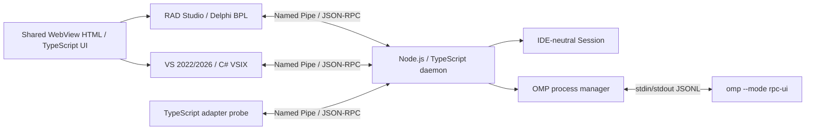

# PiAgent architecture

2026-10-04 workspace update: the authenticated adapter can negotiate
`workspace.bind.v1` and bind each closed chat to its currently open solution directory.
OMP cwd, workspace reader/change services and private session storage use that
canonical directory. VSIX listens for solution open/close and cancels the previous
connection before changing projects. Separate IDE connections retain separate
workspaces. No open solution means no fallback to the PiAgent implementation repository.
Native OMP can work with a non-Git project; Git checkpoint tools require a standalone
Git repository and are not offered when it is absent. No repository is created automatically.

`chat.approval.v1` exposes the original composer mode control through Core. Mode changes
restart only that chat's OMP process, preserving its private saved conversation. Plan
uses read-only tools; yolo/write/always-ask use OMP's matching native policy and the
adapter's original approval workflow. The original + menu routes file/folder references,
MCP metadata/configuration, plugin toggles and solution build to the owning host.

0.7.0: VS와 RAD는 동일한 WebView UI로 채팅·승인·복원을 제공한다. IDE별 미저장 문서 검사는
adapter의 UI thread에서 수행한다. Core의 SessionStore는 broker가 보호한 사용자별 디렉터리 아래에
workspace별 세션 metadata와 OMP JSONL을 저장하며, UsageService는 세션 통계와 계정 한도를 분리한다.
WorkspaceChanges는 최대 8개 파일을 하나의 revision/승인/checkpoint로 처리한다.

0.5.0: Windows pipe host가 current-user DACL, remote-client 거부와 name ownership을 담당한다.
TypeScript Core는 연결별 mutual HMAC 인증 뒤 기존 RPC를 허용한다. [보안 계약](docs/SECURITY.md).

0.4.0은 명시적 --workspace root와 `workspace.read.v1` 협상으로 Core의 읽기·literal 검색
서비스를 OMP host-tools로 등록한다. adapter는 root를 정하지 않는다. 기본 OMP 도구는 비활성화되고
Core의 제한된 두 도구만 실행된다. [Workspace 도구 계약](docs/WORKSPACE-TOOLS.md)을 따른다.

0.3.0은 VS adapter의 선택 코드 스냅샷을 `context.selection.v1`로 전달한다.
Core는 URI·언어·범위·코드만 검증하고 OMP prompt에 포함한다. 파일 조회와 IDE SDK 호출은
하지 않는다. VS UI thread의 캡처와 host 보관, UI 미리보기/전송은 adapter 책임이다.
[Selection context 계약](docs/SELECTION-CONTEXT.md)을 따른다.

## 목표와 현재 범위

PiAgent Core는 Node.js 24 LTS + TypeScript strict mode / ESM이다. Delphi BPL과
C# VSIX는 IDE SDK와 UI thread 작업만 담당한다. Core–adapter 통신은 Windows Named Pipe
JSON-RPC 2.0이며, Core–OMP 통신은 `omp --mode rpc-ui`의 stdin/stdout JSONL이다.
두 protocol은 framing, envelope, version과 lifecycle이 서로 독립적이다.

현재 vertical slice는 adapter hello/version/capability negotiation/ping, standalone daemon,
OMP process manager, C# VSIX/Delphi BPL 연결 메뉴와 transport, 독립 배포본, 테스트다.
0.2.0은 도구 없는 OMP 채팅 session/prompt/stream/cancel과 VS WebView UI까지 확장한다.
현재는 제한된 파일 읽기·검색·승인 변경, checkpoint 복원, 세션 저장·재개와 사용량 조회까지 제공한다.

## 기존 파일의 유지 / 교체

| 이전 파일/구조 | 결정 | 새 위치/이유 |
| --- | --- | --- |
| ARCHITECTURE.md / PROTOCOL.md / README.md | 유지·갱신 | 역할과 wire framing 유지, 실행 환경 변경 |
| adapters/radstudio / adapters/visualstudio | 유지 | IDE SDK 경계와 다음 구현 경로 |
| crates/piagent-protocol | Rust 소스 제거·교체 | packages/piagent-protocol |
| crates/piagent-core | Rust 소스 제거·교체 | packages/piagent-core |
| crates/piagent-daemon | Rust 소스·probe·tests 제거·교체 | packages/piagent-daemon / tests |
| Cargo.toml / Cargo.lock / rust-toolchain.toml | 제거 | package.json / package-lock.json / .nvmrc |
| scripts/install-rust.ps1 | 제거 | Node LTS 사용, 전역 Rust 설치는 변경하지 않음 |
| target / .tools | Git 제외된 기존 build/cache | 활성 소스·빌드·런타임에서 참조하지 않음 |

초기 저장소에는 commit이 없고 기존 파일이 모두 untracked였다. 다른 기능 구현은 없었다.
Rust source/build graph를 남겨 두지 않으며 npm workspace가 유일한 활성 구현이다.

## Workspace 책임

| 위치 | 책임 |
| --- | --- |
| packages/piagent-protocol | RPC DTO/ID, version, bounded binary framing |
| packages/piagent-core | connection별 Session, runtime validation, capability 교집합과 dispatch |
| packages/piagent-daemon | node:net Named Pipe server, CLI, simulator client/probe |
| packages/piagent-omp | node:child_process lifecycle, ready gate, bounded JSONL, request correlation |
| tests | node:test unit / 실제 Windows pipe / fake OMP / CLI / 독립 배포본 tests |
| scripts/package-core.mjs | workspace junction 없이 실제 파일을 복사하고 SHA-256 manifest 생성 |
| scripts/omp-smoke.mjs | 설치된 OMP에 대한 opt-in get_state smoke |
| adapters/* | BPL / VSIX 최소 메뉴, IDE-independent transport와 콘솔 smoke harness |
| ui | VS/RAD 공용 WebView 채팅·승인·복원·세션·사용량 TypeScript UI |

npm workspace local package links와 TypeScript project references로 dependency 순서를 구성한다.
ESM / NodeNext이며 strict, exactOptionalPropertyTypes, noUncheckedIndexedAccess를 켠다.
TypeScript Core에는 런타임 제3자 npm dependency와 native addon이 없다. Windows secure transport는
transport/PiAgent.PipeHost의 C#/.NET 8 helper를 사용한다. OS pipe byte relay만 맡고 IDE/agent 로직은 넣지 않는다.
Core에는 ToolsAPI, COM, HWND, VS SDK, IDE 종류에 따른 분기가 없다. adapter.kind는 opaque
metadata이며 IDE 차이는 adapter capability로 표현한다. 현재 adapter capability는 기록만 한다.

## Process / connection 수명

개발 모드에서는 `npm start -- --pipe piagent-dev`로 별도 daemon을 실행한다.
`--omp <실행파일> --cwd <workspace>`를 명시했을 때만 OMP 자식을 시작한다.
OMP 시작/ready 실패 또는 예상 밖 종료는 연결을 정리하고 CLI를 비정상 종료시킨다.
OMP 실행 경로나 workspace는 IDE wire request에서 받지 않는다.

secure transport에서는 C# pipe host가 listener를 관리하고 TypeScript Duplex로 byte relay한다.
development fixture에서는 node:net이 관리한다. 같은 endpoint의 중복 listener는 실패한다.
기본 최대 16 connection이며 초과 peer는 닫는다. 각 connection은 별도 Session으로
hello 성공 전 ping을 거절한다. read/idle deadline 30초, 각 write deadline 30초,
출력 대기량 2 MiB 제한이다. 부분 frame의 trickle bytes는 read deadline을 연장하지 않는다.
잘못된 framing/timeout은 peer 하나만 끊고, JSON/RPC 오류에는 오류 응답 후 연결을 유지한다.
reconnect 시 새 runtime Session이다. 자동 replay/reconnect는 없으며 저장된 대화는 명시적으로 재개한다.
SIGINT/SIGTERM은 모든 socket과 OMP를 정리한다. 강제 종료 뒤에도 OS가 pipe handle을 해제한다.

OMP manager는 single-use이며 cwd를 절대 경로로 받는다. shell:false / windowsHide:true로
실행파일과 argument 배열을 전달한다. `.cmd`/`.bat`는 받지 않으므로 Windows에서는 omp.exe를
사용한다. stdout과 stderr를 동시에 drain한다. 1 MiB physical JSONL limit, ready timeout,
최대 64개 pending request, ID/command correlation, request timeout을 제공한다.
stdin EOF로 정상 종료를 요청하고 deadline 이후 직접 자식을 kill한다. 전체 subprocess tree
Job Object 정리는 아직 없다. OMP child가 추가 프로세스를 띄우는 기능은 후속 lifecycle 작업이다.

현재 bridge는 OMP JSONL v1만 유지한다. ready.protocolVersion=1 및 v1 support가 있어야
사용한다(legacy ready의 version 필드 생략은 v1). v2-only/current-v2와 rpc_chunk는 명시적으로
거절한다. `negotiate_protocol`/64 MiB chunk 재조립은 후속 구현이다. ready 후 get_state,
get_available_commands, get_session_stats, new_session, switch_session, prompt, abort, set_host_tools를 programmatic API에서 허용한다.
유효한 OMP event는 frame event로 전달하고 stderr/diagnostic은 별도 event다.
Adapter pipe로 OMP raw command를 전달하는 메서드는 아직 없다.

## RADAgent reference mapping

`D:\source\RADAgent` (`kimmingul/RADAgent`)는 읽기 전용 reference implementation으로 사용한다.

| 참고 파일 | PiAgent 반영 / 후속 설계 |
| --- | --- |
| DESIGN.md / RpcClient.pas / RpcDispatch.pas / RpcProtocol.pas | transport와 dispatch 분리, ready gate, 별도 stderr, physical frame limit |
| ChatSession.pas | connection-local ChatSession이 OMP child와 turn 수명을 소유; 숨김/재표시 때 연결 유지, 종료 때 저장·lease 해제 |
| Approval.pas / ChatApproval.pas | 파일별 diff/revision 기반 승인, 연결 소유권과 취소/만료 분리 |
| GitRepo.pas / RpcResponses.pas | 승인 적용 전 raw blob과 refs/piagent/checkpoints로 파일 checkpoint; index/HEAD/branch 보존, 적용 후 blob도 보관 |
| ChatUsage.pas / UsageReport.pas | get_session_stats 세션 통계와 omp usage --json provider 한도를 구분하고 허용 필드만 정규화 |
| src/chat/chat.html / composer.js / chat.js | 입력/전송/취소와 host bridge 분리 패턴을 참고해 공용 TypeScript UI 및 승인/checkpoint/세션/사용량 표시 구현 |
| AGENTS.md | ToolsAPI 메인 스레드, IDE bitness별 BPL, unload 때 callback/notifier/pipe 해제 |

OMP response.success는 명령 접수이며 agent 턴 완료는 별도 agent_end/prompt_result다.
agent loop는 이 구분, host-tool 등록·승인·취소, save/refresh conflict를 보존한다.
0.7.0은 제한된 tracked 파일 교체와 Git checkpoint 복원을 지원한다. 새 파일/삭제/rename은 후속 범위다.

## Adapter와 UI 경계

RAD Studio는 공개 ToolsAPI를 사용하는 design-time BPL이며 IDE와 동일 bitness로 빌드한다.
worker에서 pipe I/O, 메인 스레드에서 IDE SDK 호출을 한다. C# VSIX도 async pipe I/O와
VS SDK UI thread 규칙을 따른다. VSIX manifest는 VS 2022/2026 amd64/arm64를 대상으로 한다.
VS 2022와 2026 MSBuild로 VSIX를 생성했고 RAD Studio 13.2 compiler로 Win32/Win64 BPL을
생성했다. 콘솔 harness의 transport 통신과 VS 2022/2026 PiAgentTest 프로필 설치를 검증했다.
VS 2026 18.10.3 PiAgentTest에서 실제 package load와 메뉴의 Core hello/ping을 검증했다.
0.2.0의 WebView Chat에서도 실제 OMP 응답·취소·새 대화·IDE 종료 정리를 검증했다.
VS 2022 PiAgentTest에서도 실제 메뉴 hello/ping, WebView 채팅 스트리밍·완료·새 대화·종료 정리를
검증했다. Newtonsoft.Json 직렬화는 VS 2022가 제공하는 버전과 호환되는 overload를 사용한다.
RAD 실제 host 결과는 adapter README에 기록한다.
둘 다 daemon과 다른 bitness일 수 있다. IDE 버전은 core가 판정하지 않는다.

VS의 PiAgent: Check Core Connection 메뉴는 worker에서 connect → hello → ping을
실행하고 연결을 닫는다. VS/RAD Chat은 persistent connection과 20초 ping을 사용한다. PIAGENT_PIPE_NAME 환경
변수가 endpoint를 선택하고 생략 시 piagent-dev다. C#은 CancellationToken과 dispose로
비동기 I/O를 취소하고 Output pane에 결과를 표시한다. Delphi는 overlapped I/O와 cancel event,
메인 스레드 timer polling과 WebView 출력을 사용하며 package unload 전에 worker를 join한다.
UI thread/IDE API는 transport library에 없고 콘솔 harness와 동일 코드를 사용한다.
RAD는 IOTAMenuWizard / RegisterPackageWizard로 Help → Help Wizards에 등록하고 IDE가 메뉴 수명을
관리한다. RAD 메뉴는 PiAgent: Open Chat이며 VSIX는 Tools 메뉴에 등록한다.

WebView UI는 IDE SDK 코드와 분리한다. RADAgent의 HTML/CSS/JS를 먼저 분석·재사용하고
필요한 부분을 TypeScript로 옮기되, shared view는 transcript/status/approval 모델만 다룬다.
각 adapter의 WebView host bridge가 UI message를 typed Core API로 바꾸도록 설계한다.
ui/src는 RADAgent 원본 HTML/CSS/JS를 재사용한다. strict TypeScript bridge.ts/controller.ts가 원본 UI 메시지를 PiAgent host action으로 바꾼다. 전체 정적 파일과 컴파일된 bridge/controller를 VSIX와 BPL 옆에 담는다.
VS의 WPF ToolWindowPane은 WebView2로 local virtual host의 정적 UI를 열고 typed bridge로
chat.open/prompt/cancel/close를 호출한다. UI에는 OMP raw command, IDE SDK나 shell 로직이 없다.
사용자 텍스트는 textContent, 모델 응답은 원본 Markdown renderer의 escaping을 사용한다. CSP, local-origin 확인, navigation/download
차단으로 모델 출력이 host bridge를 실행하지 못하게 한다. 원본 스타일을 임의 변경하지 않으며 UI 연결 범위는 ui/README.md에 기록한다.
WebView2 SDK의 managed DLL 및 x64/ARM64 loader는 adapter에만 있으며 Core는 native dependency가 없다.
WebView2 Runtime은 PC에 설치된 것을 사용한다. RAD BPL은 Vcl.Edge의 TEdgeBrowser를 사용하며
package 옆의 UI 및 bitness에 맞는 loader를 배포한다. Delphi worker는 pipe를 단독 소유하고,
메인 thread가 bounded queue를 polling하여 WebView와 ToolsAPI에 접근한다. unload 시 worker를 cancel/join한다.

ChatSession은 adapter connection마다 하나씩 만들고 chat.open 때 OMP를 시작한다.
ready와 new_session/switch_session 이후에 runtime session ID를 반환한다. 기본 restricted profile에서는 OMP built-in tools/extensions/skills/rules/LSP를
비활성화한다. 실험용 native profile은 이를 유지하며 아래 추가 조건과 제한을 따른다. 세션 capability가 협상되지 않았을 때는 --no-session을 사용한다. 한 번에 한 prompt만 받으며 terminal event 전에는 busy이다. 응답 접수와 턴 완료를
분리하고 cooperative abort, deadline, disconnect/exit cleanup을 수행한다. 별도 connection끼리 session과
이벤트를 공유하지 않는다. --omp가 없으면 chat.v1을 제공하지 않는다. protocol 계약은 PROTOCOL.md를 따른다.

## Windows architecture와 보안

우선 Windows x64 / ARM64 Node 24 runtime으로 같은 JS artifact를 실행한다. protocol은
UTF-8와 고정 u32 header라 pointer size와 무관하며 x86 BPL/VSIX client도 통신할 수 있다.
x86 Core runtime 배포는 Node 공식 runtime 제공 여부와 별도 검증이 필요한 미래 범위다.
OMP는 core architecture와 독립적으로 설치된 실행파일을 사용한다. 자동 다운로드는 없다.

CLI는 secure pipe host를 기본 사용한다. host는 생성 시 사용자 SID 전용 protected DACL,
network logon deny와 PIPE_REJECT_REMOTE_CLIENTS를 적용하며 첫 listener 이름 소유를 확보한다.
host/Core는 상속된 stdin/stdout으로 byte stream만 전달하고 TCP listener를 만들지 않는다.
Core의 Authentication은 연결별 nonce와 domain-separated HMAC으로 credential 소유를 검증한다.
adapter.kind 등 metadata는 executable attestation이 아니다. 같은 사용자·관리자·악성 동시 filesystem
변경까지 격리하는 sandbox는 아니다. 0.6.0의 파일 쓰기는 별도 opt-in 및 매 변경 승인으로 제한한다.
개발용 --dev-pipe/API test fixture는 Node 기본 pipe security를 사용하며 secure transport와 별개다.

기준: [Node LTS releases](https://nodejs.org/en/about/previous-releases),
[node:net](https://nodejs.org/api/net.html), [node:child_process](https://nodejs.org/api/child_process.html).

## Approved changes (0.6.0)

`--allow-writes` requires secure transport and an explicit workspace. Core's `WorkspaceChanges` owns
Git-backed single-file snapshots, revision validation, serialized writes and restore. `Approvals` is
scoped to the adapter's ChatSession; OMP can only propose, while the owning adapter decides.
The shared WebView presents full-file diffs; VS checks unsaved target documents before sending a decision.
No IDE-specific logic enters Core. Optional `workspace.edit.v1` preserves read-only adapters.

Checkpoint blobs and private refs preserve raw working bytes without changing the user's index/HEAD.
A journal precedes bounded in-place writes; uncertain interruption requires inspection, not automatic overwrite.
Each existing tracked UTF-8 file is limited to 32 KiB. Optional workspace.edit.batch.v1 supports 1–8 files,
128 KiB per batch side. All files are revalidated before writes; attempted writes roll back on failure,
without overwriting intervening edits. The filesystem update is not an atomic multi-file transaction.
See [approved changes](docs/APPROVED-CHANGES.md) for lifecycle, cancellation and recovery limits.

## Durable sessions and usage (0.7.0)

`chat.sessions.v1` opts into a private store beneath the verified credential directory, namespaced by a
hash of the canonical workspace (OMP cwd when no workspace is configured). Opaque saved IDs never expose paths.
Each active lease has an exclusive lock; close/disconnect joins OMP before flushing metadata and releasing it.
OMP runs with a private --session-dir and resumes via switch_session, preserving model history/tool results.
Displayed transcript is limited to 200 entries/256 KiB; it is separate from OMP's full conversation file.
Interrupted locks require inspection; approvals never survive a disconnected connection.

`chat.usage.v1` reads get_session_stats/get_state and queries `omp usage --json --provider` through execFile
with no shell, bounded output and a 30-second timeout. Account limits are cached for 60 seconds. Only normalized
fields cross the pipe; unknown cost/token values remain null. No price table or guessed subscription cost is used.
See [session and usage contract](docs/SESSIONS-USAGE.md) and [installation](docs/INSTALLATION.md).

## OMP 18.6 / designer integration (development)

2026-10-04 확인 기준은 OMP 18.6.0이다. OMP transport는 ready(v1) 후 지원 버전을 확인하여
v2를 협상하고 stdout rpc_chunk를 검증·재조립한다. IDE Named Pipe JSON-RPC 버전은 그대로 1이다.
새 선택 capability `omp.controls.v1`은 모델/effort 선택 및 OMP 상호작용 응답을 연결한다.
원본 RADAgent model picker와 승인 카드 스타일을 사용하며 기존 UI 배치는 변경하지 않는다.

`--omp-profile native`는 내장 도구/확장/skills/rules/LSP를 제거하지 않는다. secure transport,
명시한 workspace, --allow-writes, durable session과 adapter의 쓰기/controls 협상이 모두 필요하다.
세션별 exclusive config 파일로 tools.approvalMode=always-ask를 설정한다. 이 모드는 OS sandbox가 아니며,
OMP 내장 도구/확장에 의한 변경에는 PiAgent WorkspaceChanges 체크포인트가 적용되지 않는다.
따라서 현재 설치본의 기본 모드는 restricted이며 native는 개발 검증용 opt-in이다.
시작 중 UI가 아직 없는 시점의 대화형 확장 요청은 취소하며, 전체 확장 UX 호환은 아직 완료되지 않았다.

`ide.designer.v1`의 SDK-neutral broker는 inspect → 속성 제안 → 사용자 승인 → revision 재검사 → 적용을
중계한다. 실제 IDE API는 adapter에서만 호출한다. Core에는 WinForms/WPF/VCL 타입이 없다.
읽기 전용 연결에는 inspect만 등록한다. 문서가 workspace 밖이거나 저장되지 않았으면 변경을 거절한다.
디자이너 편집의 IDE undo/save는 Core Git checkpoint와 별도이며 자동 복원을 보장하지 않는다.

디자이너 capability가 협상된 연결은 일반 모델 요청에 GUI 개발 지침을 함께 전달한다.
GUI 작업은 열린 폼의 inspect부터 시작하고 지원하는 시각 속성은 승인된 디자이너 도구로 편집한다.
기존 UI/UX를 유지하며 지원하지 않는 작업만 필요한 승인된 소스 편집 후 디자이너와 빌드로 검증한다.
사용자의 명시적 작업 방식이 우선이고, GUI와 무관한 작업에는 폼 검사를 요구하지 않는다.
Native OMP slash 명령은 변경 없이 전달한다. 이 지침은 모델 행동 안내이며 capability/승인 검사를 대체하지 않는다.

프레임워크별 구현·검증 범위와 남은 작업은 [designer/OMP compatibility](docs/OMP-DESIGNERS.md)에 기록한다.

## Framework GUI harness (0.9.0)

Core packages versioned framework skills/catalogs as data and selects them from the live adapter snapshot.
The inspect host-tool result delivers this guidance directly to OMP. SDK-specific parent/reference rules stay
inside adapters; the Core broker validates advertised operations and approval/revision boundaries.
RAD adds existing-component reparenting and typed reference linking; Visual Studio exposes XAML syntax
hierarchy and binding references without claiming a runtime visual tree. See [GUI harness](docs/GUI-HARNESS.md).
