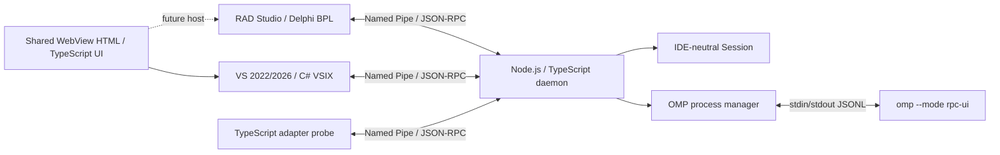

# PiAgent architecture

0.3.0은 VS adapter의 선택 코드 스냅샷을 `context.selection.v1`로 전달한다.
Core는 URI·언어·범위·코드만 검증하고 OMP prompt에 포함한다. 파일 조회와 IDE SDK 호출은
하지 않는다. VS UI thread의 캡처와 host 보관, UI 미리보기/전송은 adapter 책임이다.
[Selection context 계약](docs/SELECTION-CONTEXT.md)을 따른다.

## 목표와 현재 범위

PiAgent Core는 Node.js 24 LTS + TypeScript strict mode / ESM이다. Delphi BPL과
C# VSIX는 IDE SDK와 UI thread 작업만 담당한다. Core–adapter 통신은 Windows Named Pipe
JSON-RPC 2.0이며, Core–OMP 통신은 `omp --mode rpc-ui`의 stdin/stdout JSONL이다.
두 protocol은 framing, envelope, version과 lifecycle이 서로 독립적이다.

현재 vertical slice는 adapter hello/version/capability negotiation/ping, standalone daemon,
OMP process manager, C# VSIX/Delphi BPL 연결 메뉴와 transport, 독립 배포본, 테스트다.
0.2.0은 도구 없는 OMP 채팅 session/prompt/stream/cancel과 VS WebView UI까지 확장한다.
IDE host tools, 파일 변경, approval, checkpoint, usage 집계는 후속 범위다.

## 기존 파일의 유지 / 교체

| 이전 파일/구조 | 결정 | 새 위치/이유 |
| --- | --- | --- |
| ARCHITECTURE.md / PROTOCOL.md / README.md | 유지·갱신 | 역할과 wire framing 유지, 실행 환경 변경 |
| adapters/radstudio / adapters/visualstudio | 유지 | IDE SDK 경계와 다음 구현 경로 |
| crates/piagent-protocol | Rust 소스 제거·교체 | packages/piagent-protocol |
| crates/piagent-core | Rust 소스 제거·교체 | packages/piagent-core |
| crates/piagent-daemon | Rust 소스·probe·tests 제거·교체 | packages/piagent-daemon / tests |
| Cargo.toml / Cargo.lock / rust-toolchain.toml | 제거 | package.json / package-lock.json / .nvmrc |
| scripts/install-rust.ps1 | 제거 | Node LTS 사용, 전역 Rust 설치는 변경하지 않음 |
| target / .tools | Git 제외된 기존 build/cache | 활성 소스·빌드·런타임에서 참조하지 않음 |

초기 저장소에는 commit이 없고 기존 파일이 모두 untracked였다. 다른 기능 구현은 없었다.
Rust source/build graph를 남겨 두지 않으며 npm workspace가 유일한 활성 구현이다.

## Workspace 책임

| 위치 | 책임 |
| --- | --- |
| packages/piagent-protocol | RPC DTO/ID, version, bounded binary framing |
| packages/piagent-core | connection별 Session, runtime validation, capability 교집합과 dispatch |
| packages/piagent-daemon | node:net Named Pipe server, CLI, simulator client/probe |
| packages/piagent-omp | node:child_process lifecycle, ready gate, bounded JSONL, request correlation |
| tests | node:test unit / 실제 Windows pipe / fake OMP / CLI / 독립 배포본 tests |
| scripts/package-core.mjs | workspace junction 없이 실제 파일을 복사하고 SHA-256 manifest 생성 |
| scripts/omp-smoke.mjs | 설치된 OMP에 대한 opt-in get_state smoke |
| adapters/* | BPL / VSIX 최소 메뉴, IDE-independent transport와 콘솔 smoke harness |
| ui | RADAgent WebView UI 재사용·TypeScript 정리 계획 |

npm workspace local package links와 TypeScript project references로 dependency 순서를 구성한다.
ESM / NodeNext이며 strict, exactOptionalPropertyTypes, noUncheckedIndexedAccess를 켠다.
런타임 제3자 dependency와 native addon은 없다. TypeScript와 Node 타입만 개발 dependency다.
Core에는 ToolsAPI, COM, HWND, VS SDK, IDE 종류에 따른 분기가 없다. adapter.kind는 opaque
metadata이며 IDE 차이는 adapter capability로 표현한다. 현재 adapter capability는 기록만 한다.

## Process / connection 수명

개발 모드에서는 `npm start -- --pipe piagent-dev`로 별도 daemon을 실행한다.
`--omp <실행파일> --cwd <workspace>`를 명시했을 때만 OMP 자식을 시작한다.
OMP 시작/ready 실패 또는 예상 밖 종료는 연결을 정리하고 CLI를 비정상 종료시킨다.
OMP 실행 경로나 workspace는 IDE wire request에서 받지 않는다.

node:net이 listener와 pipe instance를 관리한다. 같은 endpoint의 중복 bind는 실패한다.
기본 최대 16 connection이며 초과 peer는 닫는다. 각 connection은 별도 Session으로
hello 성공 전 ping을 거절한다. read/idle deadline 30초, 각 write deadline 30초,
출력 대기량 2 MiB 제한이다. 부분 frame의 trickle bytes는 read deadline을 연장하지 않는다.
잘못된 framing/timeout은 peer 하나만 끊고, JSON/RPC 오류에는 오류 응답 후 연결을 유지한다.
reconnect 시 새 Session이다. 자동 replay, reconnect 또는 durable session 복원은 없다.
SIGINT/SIGTERM은 모든 socket과 OMP를 정리한다. 강제 종료 뒤에도 OS가 pipe handle을 해제한다.

OMP manager는 single-use이며 cwd를 절대 경로로 받는다. shell:false / windowsHide:true로
실행파일과 argument 배열을 전달한다. `.cmd`/`.bat`는 받지 않으므로 Windows에서는 omp.exe를
사용한다. stdout과 stderr를 동시에 drain한다. 1 MiB physical JSONL limit, ready timeout,
최대 64개 pending request, ID/command correlation, request timeout을 제공한다.
stdin EOF로 정상 종료를 요청하고 deadline 이후 직접 자식을 kill한다. 전체 subprocess tree
Job Object 정리는 아직 없다. OMP child가 추가 프로세스를 띄우는 기능은 후속 lifecycle 작업이다.

현재 bridge는 OMP JSONL v1만 유지한다. ready.protocolVersion=1 및 v1 support가 있어야
사용한다(legacy ready의 version 필드 생략은 v1). v2-only/current-v2와 rpc_chunk는 명시적으로
거절한다. `negotiate_protocol`/64 MiB chunk 재조립은 후속 구현이다. ready 후 get_state,
get_available_commands, get_session_stats, new_session, prompt, abort를 programmatic API에서 허용한다.
유효한 OMP event는 frame event로 전달하고 stderr/diagnostic은 별도 event다.
Adapter pipe로 OMP raw command를 전달하는 메서드는 아직 없다.

## RADAgent reference mapping

`D:\source\RADAgent` (`kimmingul/RADAgent`)는 읽기 전용 reference implementation으로 사용한다.

| 참고 파일 | PiAgent 반영 / 후속 설계 |
| --- | --- |
| DESIGN.md / RpcClient.pas / RpcDispatch.pas / RpcProtocol.pas | transport와 dispatch 분리, ready gate, 별도 stderr, physical frame limit |
| ChatSession.pas | connection-local ChatSession이 ephemeral OMP child와 turn 수명을 소유; 숨김/재표시 때 VS chat connection 유지 |
| Approval.pas / ChatApproval.pas | 향후 IDE 변경 전에 diff/target 기반 승인, 승인 ID와 취소/수명 분리; 현재 변경 도구 없음 |
| GitRepo.pas / RpcResponses.pas | 향후 사용자 메시지 직전 별도 index와 refs/piagent/cp로 checkpoint; index/HEAD/branch 보존, restore 전 safety ref |
| ChatUsage.pas / UsageReport.pas | 향후 get_session_stats의 세션 사용량과 별도 omp usage --json provider 한도를 구분; 현재 raw response만 전달 |
| src/chat/chat.html / composer.js / chat.js | 입력/전송/취소와 host bridge 분리 패턴을 참고해 작은 shared TypeScript UI 작성; 승인/checkpoint UI는 후속 |
| AGENTS.md | ToolsAPI 메인 스레드, IDE bitness별 BPL, unload 때 callback/notifier/pipe 해제 |

OMP response.success는 명령 접수이며 agent 턴 완료는 별도 agent_end/prompt_result다.
후속 agent loop는 이 구분, host-tool 등록·승인·취소, save/refresh conflict를 보존해야 한다.
0.2.0에서는 도구 없는 agent prompt를 실행한다. Git 변경·IDE/file 변경 도구는 후속 범위다.

## Adapter와 UI 경계

RAD Studio는 공개 ToolsAPI를 사용하는 design-time BPL이며 IDE와 동일 bitness로 빌드한다.
worker에서 pipe I/O, 메인 스레드에서 IDE SDK 호출을 한다. C# VSIX도 async pipe I/O와
VS SDK UI thread 규칙을 따른다. VSIX manifest는 VS 2022/2026 amd64/arm64를 대상으로 한다.
VS 2022와 2026 MSBuild로 VSIX를 생성했고 RAD Studio 13.2 compiler로 Win32/Win64 BPL을
생성했다. 콘솔 harness의 transport 통신과 VS 2022/2026 PiAgentTest 프로필 설치를 검증했다.
VS 2026 18.10.3 PiAgentTest에서 실제 package load와 메뉴의 Core hello/ping을 검증했다.
0.2.0의 WebView Chat에서도 실제 OMP 응답·취소·새 대화·IDE 종료 정리를 검증했다.
VS 2022 PiAgentTest에서도 실제 메뉴 hello/ping, WebView 채팅 스트리밍·완료·새 대화·종료 정리를
검증했다. Newtonsoft.Json 직렬화는 VS 2022가 제공하는 버전과 호환되는 overload를 사용한다.
RAD 실제 host 결과는 adapter README에 기록한다.
둘 다 daemon과 다른 bitness일 수 있다. IDE 버전은 core가 판정하지 않는다.

두 adapter의 PiAgent: Check Core Connection 메뉴는 worker에서 connect → hello → ping을
실행하고 연결을 닫는다. VS Chat은 별도 persistent connection과 20초 ping을 사용한다. PIAGENT_PIPE_NAME 환경
변수가 endpoint를 선택하고 생략 시 piagent-dev다. C#은 CancellationToken과 dispose로
비동기 I/O를 취소하고 Output pane에 결과를 표시한다. Delphi는 overlapped I/O와 cancel event,
메인 스레드 timer polling과 Messages 출력을 사용하며 package unload 전에 worker를 join한다.
UI thread/IDE API는 transport library에 없고 콘솔 harness와 동일 코드를 사용한다.
RAD는 IOTAMenuWizard / RegisterPackageWizard로 Help → Help Wizards에 등록하고 IDE가 메뉴 수명을
관리한다. VSIX는 Tools 메뉴에 등록한다. RAD Messages view는 연결 검사 완료 후 자동으로 표시한다.

WebView UI는 IDE SDK 코드와 분리한다. RADAgent의 HTML/CSS/JS를 먼저 분석·재사용하고
필요한 부분을 TypeScript로 옮기되, shared view는 transcript/status/approval 모델만 다룬다.
각 adapter의 WebView host bridge가 UI message를 typed Core API로 바꾸도록 설계한다.
ui/src/chat.ts는 strict DOM TypeScript이고 ui/src/chat.html/chat.css와 함께 VSIX에 담는다.
VS의 WPF ToolWindowPane은 WebView2로 local virtual host의 정적 UI를 열고 typed bridge로
chat.open/prompt/cancel/close를 호출한다. UI에는 OMP raw command, IDE SDK나 shell 로직이 없다.
HTML transcript는 textContent/TextNode만 사용한다. CSP, local-origin 확인, navigation/download
차단으로 모델 출력이 host bridge를 실행하지 못하게 한다. UI 표시량은 메시지당 2M 문자와 100행이다.
WebView2 SDK의 managed DLL 및 x64/ARM64 loader는 adapter에만 있으며 Core는 native dependency가 없다.
WebView2 Runtime은 PC에 설치된 것을 사용한다. RAD BPL은 이번 단계에서는 handshake/ping 메뉴를 유지한다.

ChatSession은 adapter connection마다 하나씩 만들고 chat.open 때 OMP를 시작한다.
ready/new_session 이후에 session ID를 반환한다. OMP는 tools/extensions/skills/rules/LSP와 session
저장을 비활성화한다. 한 번에 한 prompt만 받으며 terminal event 전에는 busy이다. 응답 접수와 턴 완료를
분리하고 cooperative abort, deadline, disconnect/exit cleanup을 수행한다. 별도 connection끼리 session과
이벤트를 공유하지 않는다. --omp가 없으면 chat.v1을 제공하지 않는다. protocol 계약은 PROTOCOL.md를 따른다.

## Windows architecture와 보안

우선 Windows x64 / ARM64 Node 24 runtime으로 같은 JS artifact를 실행한다. protocol은
UTF-8와 고정 u32 header라 pointer size와 무관하며 x86 BPL/VSIX client도 통신할 수 있다.
x86 Core runtime 배포는 Node 공식 runtime 제공 여부와 별도 검증이 필요한 미래 범위다.
OMP는 core architecture와 독립적으로 설치된 실행파일을 사용한다. 자동 다운로드는 없다.

현재 Node 기본 pipe security descriptor를 사용하고 readableAll/writableAll을 열지 않는다.
Node net API로 사용자 SID DACL / peer identity / PIPE_REJECT_REMOTE_CLIENTS를 직접 설정하지
않으므로, 기존 Rust 옵션의 remote-client 거절 보장은 유지됐다고 주장하지 않는다.
현재 pipe에는 ping과 opt-in 도구 없는 채팅을 노출한다. privileged IDE/file 작업 전에 사용자 전용 ACL, endpoint
identity/authentication과 remote 연결 차단 정책을 구현·검증해야 한다. metadata는 인증이 아니다.

기준: [Node LTS releases](https://nodejs.org/en/about/previous-releases),
[node:net](https://nodejs.org/api/net.html), [node:child_process](https://nodejs.org/api/child_process.html).
