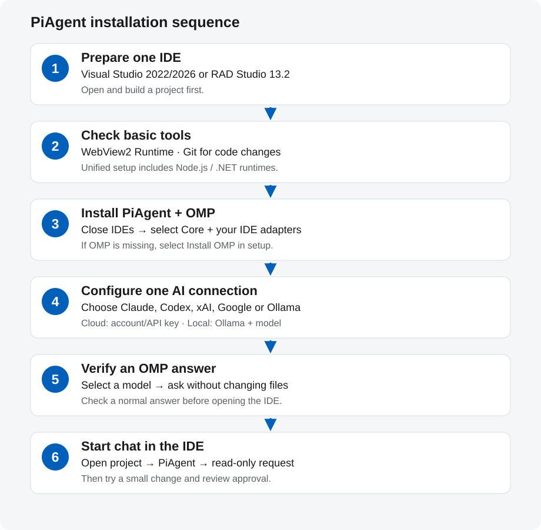

# Install PiAgent for the first time

[한국어](GETTING-STARTED.ko.md) · **English** · [Documentation](README.md)

For Windows x64/ARM64 and the PiAgent **0.11.1 scoped prerelease**. Checked **2026-10-10 KST**. Check the [release page](https://github.com/kimmingul/PiAgent/releases/tag/v0.11.1) for final installer bytes and SHA-256.
This guide is for people who have never used OMP or an AI coding tool.

**Start with one IDE and one AI connection.** PiAgent provides chat inside your IDE.
**oh-my-pi (OMP)** sends those requests to an AI model and runs the work.
Claude Code, Codex, Grok Build and Antigravity are separate AI tools.
OMP's direct provider connections do not require installing all of those applications.
For local models through Ollama, install Ollama and download a model as well.

| Term | Meaning |
|---|---|
| IDE | A development application for editing code, designing forms and building programs |
| Provider / model | A provider is an AI service; a model is the AI you select within that service. |
| CLI / terminal | A CLI is a program you run by entering commands in a terminal window. |
| API key | A secret access value issued by an AI service, an alternative to browser account sign-in. |

## Installation at a glance



1. **Prepare an IDE** — Install Visual Studio or a supported RAD Studio and run a project once.
2. **Check basic tools** — Prepare WebView2 Runtime and Git for code changes.
3. **Install PiAgent + OMP** — Close your IDEs and select the components you will use in setup.
4. **Configure one AI connection** — Choose account sign-in, an API key or a local model.
5. **Verify an OMP answer** — Select a model and ask a simple question.
6. **Start chat in the IDE** — Open a project and begin with a read-only request in PiAgent.

If OMP already works, reuse it in step 3 and verify from step 5.
You can also install and authenticate OMP separately before installing PiAgent.

## 1. Install the IDE you will use

| Development environment | What the current PiAgent setup supports | What to prepare |
|---|---|---|
| Visual Studio 2022 (17.14+) / 2026 | Registers PiAgent in an installed IDE | This is a different product from Visual Studio Code. For C# WinForms/WPF, choose the `.NET desktop development` workload; other languages need their project's workloads. |
| RAD Studio 13.2 / Delphi 37.0 | Registers packages for 32-bit / 64-bit IDEs | Prepare Delphi/C++Builder and the VCL/FMX environment you use, then build a project. |
| RAD Studio 11 / 12 and other RAD compiler versions | Not automatically registered by the 0.11.1 setup | Build the PiAgent BPL separately with the target version's SDK. Do not install the 13.2 BPL unchanged. |

You do not need both IDE families. Current live testing prioritizes VS2026 and RAD13.2 64-bit.
Installation/build support for VS2022 and RAD32 does not mean complete live validation.
[Official Visual Studio installation guide](https://learn.microsoft.com/en-us/visualstudio/install/install-visual-studio?view=visualstudio) ·
[Official RAD Studio site](https://www.embarcadero.com/products/rad-studio).

**Done when:** your project opens in the IDE and its existing code builds.

## 2. Check basic tools

| Tool | When you need it | How to prepare it |
|---|---|---|
| Microsoft Edge WebView2 Runtime | PiAgent chat window | If missing, install **Evergreen Runtime** from the [official WebView2 download](https://developer.microsoft.com/en-us/microsoft-edge/webview2/). You do not need the SDK. |
| Git for Windows | PiAgent's approved file changes, checkpoints and restore | Install [official Git](https://git-scm.com/install/windows), then check `git --version`. The project needs a Git repository and an initial commit. |
| Node.js / .NET runtimes | PiAgent Core | **Included in unified setup.** You do not need a separate npm/TypeScript environment to install PiAgent. Follow each optional AI tool's own runtime requirements. |

Use an existing Git project or a new practice project. Create an initial commit through the IDE's Git tools,
excluding build outputs, passwords and API keys. Checking chat connectivity and preparing code changes are separate steps.

**Done when:** WebView2 is available and your code-change project has Git and an initial commit.

## 3. Install PiAgent and OMP

1. Download `PiAgent-Setup-0.11.1.exe` and its `.exe.sha256` from the [PiAgent 0.11.1 release](https://github.com/kimmingul/PiAgent/releases/tag/v0.11.1), then verify the hash. See the [release record](RELEASE-0.11.1.en.md) for validation scope.
2. Close Visual Studio and RAD Studio.
3. Run setup. Select Korean/English at the top right if needed.
4. Select **Core** and the IDE components you will use. For RAD, match the **IDE's own bitness**;
   this is different from your project's Win32/Win64 output target.
5. If OMP is missing, select **Install OMP**. A detected existing OMP installation is reused.
6. After installation, open **Start OMP (sign-in and settings)** or **OMP 실행 (로그인 및 설정)** from the Start Menu.

PiAgent does not install the IDE or separate Claude Code/Codex applications for you.
Selected OMP downloads come from official releases with hash checks, but **you complete AI authentication separately**.

In a terminal, `omp --version` checks whether the command works. A missing `omp` command does not necessarily mean
installation failed: PiAgent-managed OMP may not be on the global PATH. Try the Start Menu shortcut first.
For a separate installation, follow the [official OMP installation guide](https://github.com/can1357/oh-my-pi#install).
PiAgent needs an actual Windows `omp.exe`.

**Done when:** PiAgent setup finishes and OMP opens or `omp --version` prints a version.

## 4. Choose one AI connection

**Installation**, **authentication** and **model selection** are separate steps. Signing into another application
does not automatically finish OMP setup. Pick one route below.
For cloud routes, prepare a service account and model access first; if you need an account, follow that
service's official sign-up instructions. For local Ollama, follow the local setup below.

| AI you want | What OMP needs | Role of a separate app/CLI |
|---|---|---|
| Claude / Anthropic | An API key or permitted authentication method for OMP's Anthropic connection | Follow [Claude Code setup/sign-in](https://code.claude.com/docs/en/quickstart) when using Claude Code itself. Installing/subscribing to Claude Code does not guarantee OMP access. |
| OpenAI / Codex | Choose OMP's `openai-codex` sign-in or the `openai` API-key route | [Codex CLI](https://learn.chatgpt.com/docs/codex/cli) and [official authentication](https://learn.chatgpt.com/docs/auth) cover separate Codex use. OMP direct connections do not require the Codex app/CLI. |
| Grok / xAI | An API key for OMP's xAI connection or login offered by your OMP version | [Official Grok Build setup](https://docs.x.ai/build/overview) is for the separate `grok` tool. Verify Grok Build sign-in and OMP xAI authentication separately. |
| Google / Antigravity | A Google/Antigravity login route offered by OMP and model access for that account | Use [official Antigravity downloads](https://www.antigravity.google/download) and [CLI setup](https://www.antigravity.google/docs/cli/install/). Installing the app alone does not finish OMP setup. |
| Ollama local models | **Install Ollama → download a model → run the local server → select it in OMP** | The local route needs Ollama and a model. Choose one that fits your RAM/GPU and supports tool calling. [Windows setup](https://docs.ollama.com/windows) · [Quickstart](https://docs.ollama.com/quickstart). |

### Cloud account or API key

Type `/login` in OMP, or run this terminal command to choose a provider. Follow **that provider's OMP instructions**
for browser sign-in, account selection or an API key. If a provider is missing, check the installed version against
the [official OMP provider guide](https://github.com/can1357/oh-my-pi/blob/main/docs/providers.md).

```powershell
omp login
```

For the OpenAI Codex route, you can also specify the provider directly:

```powershell
omp login openai-codex
```

After authentication, select an available model with `/model` in OMP. Subscriptions and API billing may be separate;
models and limits depend on your account and provider policies. Keep keys and authentication codes out of README and Git.
[OMP authentication reference](https://github.com/can1357/oh-my-pi/tree/main/packages/ai#oauth-providers).

### Local Ollama route

Install and open the Ollama Windows app. Choose and download a model after checking hardware requirements
and tool-calling support. Use an **actual name from Ollama's official model catalog** in commands.

```powershell
ollama --version
ollama list
```

If no model is downloaded, use `ollama pull <chosen-model-name>`. The `<...>` text is a placeholder;
replace it before running the command. Once the model appears in `ollama list` and the app/server is running,
check OMP's `/model`. If discovery fails, follow [OMP local/custom model configuration](https://github.com/can1357/oh-my-pi/blob/main/docs/providers.md).
Local Ollama and Ollama Cloud have different authentication and billing routes.

**Done when:** OMP lists an available model and you have selected it.

## 5. Verify an OMP answer before opening the IDE

Ask OMP to greet you in one sentence without changing files. An answer confirms the AI connection works.
If it fails, resolve OMP account/model/network issues first; repeatedly reinstalling the IDE is unnecessary at this stage.
You can start with one model without configuring multiple roles, plugins or MCP servers.

**Done when:** the selected model returns a normal answer. Close your OMP test conversation afterward.

## 6. Start PiAgent in the IDE

1. Restart the IDE and open a practice or existing project.
2. Visual Studio: **Tools → PiAgent: Open Chat**.
   RAD Studio: **View → PiAgent** or **Tools → PiAgent**.
3. Unified setup starts Core automatically. Check the connection status and project name.
4. Check authentication and the selected model under **Settings → Account** and **Model roles**.
   Providers with RPC login can use the Account tab; if terminal authentication is requested, sign in through OMP.
5. Ask: “Explain this project's structure. Do not change files.”
6. After that succeeds, try a small change and review its diff and approval scope.

Fresh Core installations may use read-only settings. To enable edits, configure the project scope and write
setting using the installation details below, then use approval. Finishing setup alone does not enable writes.
The default language is Korean on Korean systems and English elsewhere.
Explicit choices under **Settings → Display → Language** are saved per project.
For code-change configuration/support, see [installation details](INSTALLATION.en.md);
for RAD form changes, see the [designer guide](RAD-DESIGNER-DIAGNOSTICS.en.md).

**Done when:** PiAgent in your IDE returns its first answer using the correct project and model.

## Where to look when something fails

| Symptom | Check first |
|---|---|
| An IDE checkbox is disabled in setup | Install the IDE first and check the supported version. RAD11/12 need a separate BPL. |
| Chat is blank or missing | Check WebView2 Evergreen Runtime and PiAgent installation, then restart the IDE. |
| The `omp` command is missing | Use the Start Menu OMP shortcut or the installed `omp.exe` path. |
| OMP login fails, no model appears or no answer arrives | Check provider authentication, model access, API balance/limits, network or local server. |
| OMP works but PiAgent cannot connect | Check Core/OMP paths and IDE registration using the [unified installer guide](UNIFIED-INSTALLER.md); retain the original error for diagnosis. |
| Connected, but file/form edits are blocked | Check the initial Git commit, write configuration, approval card, unsaved forms and read-only files. [RAD diagnostics](RAD-DESIGNER-DIAGNOSTICS.en.md). |

Check **installation finished**, **OMP answers**, then **IDE code changes work**, in that order.
This makes the failing stage easier to locate. This guide describes installation; it does not claim complete validation
of every provider, model and IDE combination.
