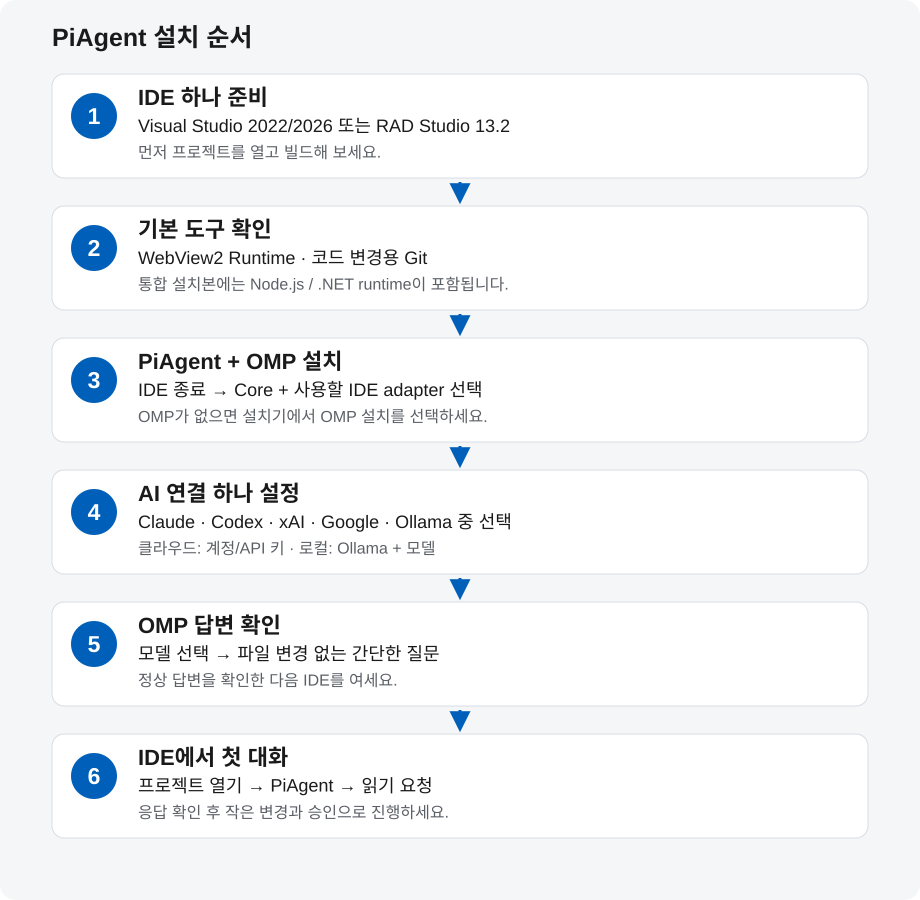

# PiAgent 처음 설치하기

**한국어** · [English](GETTING-STARTED.en.md) · [문서 목록](README.md)

대상: Windows x64/ARM64, PiAgent **0.9.20**. 확인일: **2026-10-09 KST**.
OMP나 AI 코딩 도구를 처음 사용하는 분을 위한 안내입니다.

**사용할 IDE 하나와 AI 연결 하나부터 준비하세요.** PiAgent는 IDE 안의 채팅 화면이고,
**oh-my-pi(OMP)**는 그 화면의 요청을 AI 모델에 전달하고 작업을 실행하는 프로그램입니다.
Claude Code, Codex, Grok Build, Antigravity는 각각 별도의 AI 도구입니다.
OMP의 직접 연결을 사용하면 이 프로그램들을 전부 설치할 필요는 없습니다.
Ollama로 로컬 모델을 사용한다면 Ollama와 해당 모델을 추가로 설치합니다.

| 처음 나오는 용어 | 뜻 |
|---|---|
| IDE | 코드를 편집하고 폼을 디자인하고 프로그램을 빌드하는 개발 프로그램 |
| 제공자 / 모델 | 제공자는 AI 서비스이고, 모델은 그 서비스에서 사용할 AI입니다. |
| CLI / 터미널 | CLI는 터미널 창에서 명령을 입력해 실행하는 프로그램입니다. |
| API 키 | AI 서비스가 발급하는 접속용 비밀값입니다. 브라우저 계정 로그인과 다른 인증 방법입니다. |

## 설치 순서 한눈에 보기



1. **IDE 준비** — Visual Studio 또는 지원되는 RAD Studio를 설치하고 프로젝트를 한번 실행합니다.
2. **기본 도구 확인** — WebView2 Runtime, 코드 변경에 사용할 Git을 준비합니다.
3. **PiAgent + OMP 설치** — IDE를 종료하고 PiAgent 설치파일에서 사용할 구성요소를 선택합니다.
4. **AI 연결 하나 설정** — 계정 로그인 또는 API 키, 로컬 모델 중 한 경로를 선택합니다.
5. **OMP 응답 확인** — 모델을 선택해 간단한 질문의 답변이 오는지 확인합니다.
6. **IDE에서 첫 대화** — 프로젝트를 열고 PiAgent에서 먼저 읽기 요청을 해봅니다.

이미 OMP를 사용한다면 3단계에서 기존 OMP를 재사용하고 5단계부터 확인하면 됩니다.
OMP를 직접 먼저 설치하고 로그인한 다음 PiAgent를 설치하는 순서도 가능합니다.

## 1. 사용할 IDE를 먼저 설치하세요

| 개발 환경 | 현재 PiAgent 설치파일에서 가능한 것 | 시작할 때 확인할 것 |
|---|---|---|
| Visual Studio 2022 / 2026 | 설치된 IDE에 PiAgent 확장 등록 | Visual Studio Code와 다른 제품입니다. C# WinForms/WPF에는 `.NET 데스크톱 개발` 워크로드를 선택합니다. 다른 언어는 해당 프로젝트용 워크로드를 선택합니다. |
| RAD Studio 13.2 / Delphi 37.0 | 32-bit / 64-bit IDE용 패키지 등록 | Delphi/C++Builder와 사용할 VCL/FMX 개발 환경을 준비하고 프로젝트를 빌드해 봅니다. |
| RAD Studio 11 / 12, 다른 RAD compiler 버전 | 현재 0.9.20 설치파일의 자동 등록 대상이 아님 | 해당 버전의 SDK로 PiAgent BPL을 별도 빌드해야 합니다. 13.2용 BPL을 그대로 설치하지 마세요. |

두 종류의 IDE를 모두 설치할 필요는 없습니다. 현재 실사용 검증은 VS2026과 RAD13.2 64-bit를
우선합니다. VS2022와 RAD32의 설치·빌드 지원을 전체 실사용 검증 완료로 해석하지 않습니다.
[Visual Studio 공식 설치 안내](https://learn.microsoft.com/en-us/visualstudio/install/install-visual-studio?view=visualstudio) ·
[RAD Studio 공식 사이트](https://www.embarcadero.com/products/rad-studio).

**완료 기준:** IDE에서 사용할 프로젝트가 열리고 기존 코드가 빌드됩니다.

## 2. 기본 도구를 확인하세요

| 도구 | 필요한 시점 | 준비 방법 |
|---|---|---|
| Microsoft Edge WebView2 Runtime | PiAgent 채팅 화면 | 없으면 [공식 WebView2 다운로드](https://developer.microsoft.com/en-us/microsoft-edge/webview2/)에서 **Evergreen Runtime**을 설치합니다. SDK를 내려받을 필요는 없습니다. |
| Git for Windows | PiAgent의 승인 파일 변경·변경 기록·복원 | [공식 Git 설치](https://git-scm.com/install/windows) 후 터미널에서 `git --version`으로 확인합니다. 프로젝트는 Git 저장소이고 첫 커밋이 있어야 합니다. |
| Node.js / .NET runtime | PiAgent Core 실행 | **통합 설치파일에 포함**되어 있습니다. PiAgent 설치를 위해 별도로 npm/TypeScript 환경을 만들 필요는 없습니다. 다른 AI 도구가 자체 요구하는 runtime은 해당 도구 안내를 따릅니다. |

처음에는 기존 Git 프로젝트나 새 연습 프로젝트를 사용하세요. IDE의 Git 메뉴에서 첫 커밋을 만들고,
빌드 결과·비밀번호·API 키를 커밋 대상에 넣지 않습니다. 채팅 연결 확인과 코드 변경 준비는 별개입니다.

**완료 기준:** WebView2가 설치되어 있고, 코드 변경을 시도할 프로젝트에는 Git과 첫 커밋이 있습니다.

## 3. PiAgent와 OMP를 설치하세요

1. [PiAgent 0.9.20 릴리즈](https://github.com/kimmingul/PiAgent/releases/tag/v0.9.20)에서
   `PiAgent-Setup-0.9.20.exe`를 내려받습니다.
2. Visual Studio와 RAD Studio를 모두 종료합니다.
3. 설치파일을 실행합니다. 오른쪽 위에서 한국어/English를 선택할 수 있습니다.
4. **Core**와 실제로 사용할 IDE 항목을 선택합니다. RAD는 **IDE 자체의 bitness**에 맞춰 선택합니다.
   프로젝트 출력이 Win32인지 Win64인지와는 다른 구분입니다.
5. OMP가 없다면 **OMP 설치**를 선택합니다. 기존 OMP가 발견되면 재사용합니다.
6. 설치 완료 후 시작 메뉴의 **OMP 실행 (로그인 및 설정)** 또는 **Start OMP (sign-in and settings)**를 엽니다.

PiAgent가 IDE나 Claude Code/Codex 등의 별도 앱까지 설치하지는 않습니다.
설치 중 선택한 OMP는 공식 릴리즈에서 내려받고 해시를 확인하지만, **AI 로그인은 사용자가 별도로 진행**합니다.

터미널을 쓰는 경우 `omp --version`으로 실행 여부를 확인할 수 있습니다.
`omp`를 찾지 못해도 설치 실패를 뜻하지는 않습니다. PiAgent가 설치한 OMP는 전역 PATH에 등록되지
않을 수 있으므로 시작 메뉴 바로가기를 먼저 사용하세요.
직접 OMP를 설치하려면 [공식 OMP 설치 안내](https://github.com/can1357/oh-my-pi#install)를 따릅니다.
PiAgent에는 실제 Windows `omp.exe`가 필요합니다.

**완료 기준:** PiAgent 설치가 끝나고 OMP 화면 또는 `omp --version`의 버전 번호가 나타납니다.

## 4. AI 연결은 한 경로부터 선택하세요

**설치**, **로그인**, **모델 선택**은 서로 다른 단계입니다. 다른 앱에서 로그인했다고 OMP 연결이
자동으로 완성되는 것은 아닙니다. 다음 표에서 자신이 사용할 경로 하나를 선택하세요.
클라우드 경로는 해당 서비스 계정과 모델 접근 권한을 먼저 준비합니다. 계정이 없으면 서비스의
공식 가입 안내를 따르세요. 로컬 Ollama 경로는 아래의 로컬 설치 안내로 진행합니다.

| 원하는 AI | OMP에 필요한 준비 | 별도 앱/CLI의 역할 |
|---|---|---|
| Claude / Anthropic | OMP가 제공하는 Anthropic 연결에 사용할 API 키 또는 허용되는 인증 방식 | [Claude Code 설치·로그인](https://code.claude.com/docs/en/quickstart)은 Claude Code 자체를 사용할 때 따릅니다. Claude Code 설치·구독만으로 OMP 사용 권한이 보장되지는 않습니다. |
| OpenAI / Codex | OMP의 `openai-codex` 로그인 또는 `openai` API 키 경로 중 선택 | [Codex CLI](https://learn.chatgpt.com/docs/codex/cli)와 [공식 로그인 안내](https://learn.chatgpt.com/docs/auth)는 별도 Codex 사용용입니다. OMP 직접 연결에는 Codex 앱/CLI 설치가 필수는 아닙니다. |
| Grok / xAI | OMP의 xAI 연결에 사용할 API 키 또는 해당 버전이 제공하는 로그인 | [Grok Build 공식 설치 안내](https://docs.x.ai/build/overview)는 별도 `grok` 도구를 사용할 때 필요합니다. Grok Build 로그인과 OMP의 xAI 인증은 따로 확인합니다. |
| Google / Antigravity | OMP에서 제공되는 Google/Antigravity 인증 경로와 해당 계정의 모델 접근 권한 | [Antigravity 공식 다운로드](https://www.antigravity.google/download)와 [CLI 설치 안내](https://www.antigravity.google/docs/cli/install/)를 따릅니다. 앱 설치만으로 OMP 연결이 완료되지는 않습니다. |
| Ollama 로컬 모델 | **Ollama 설치 → 모델 다운로드 → 로컬 서버 실행 → OMP 모델 선택** | 로컬 추론 경로에서는 Ollama와 모델이 필요합니다. PC 메모리/GPU에 맞고 도구 호출을 지원하는 모델을 선택합니다. [Windows 설치](https://docs.ollama.com/windows) · [시작 안내](https://docs.ollama.com/quickstart). |

### 클라우드 계정 또는 API 키

OMP 화면에서 `/login`을 입력하거나, 터미널에서 아래 명령으로 제공자를 선택합니다.
브라우저 로그인, 계정 선택 또는 API 키 입력은 **OMP가 안내하는 해당 제공자의 방식**으로 진행합니다.
표시되지 않는 제공자는 설치한 OMP 버전의 [공식 제공자 안내](https://github.com/can1357/oh-my-pi/blob/main/docs/providers.md)를 확인합니다.

```powershell
omp login
```

OpenAI Codex 경로를 선택한 경우 다음처럼 제공자를 직접 지정할 수도 있습니다.

```powershell
omp login openai-codex
```

인증 후 OMP에서 `/model`로 사용 가능한 모델을 선택합니다. 구독과 API 과금은 별개일 수 있으며,
이용 가능한 모델·한도는 계정과 제공자 정책에 따라 달라집니다. 키와 인증 코드를 README나 Git에 넣지 마세요.
[OMP 인증 설명](https://github.com/can1357/oh-my-pi/tree/main/packages/ai#oauth-providers).

### Ollama 로컬 경로

Ollama Windows 앱을 설치하고 실행한 다음, 모델 목록에서 PC 사양과 도구 호출 지원을 확인해
선택한 모델을 다운로드합니다. 명령에 들어가는 이름은 **Ollama 공식 모델 목록의 실제 이름**입니다.

```powershell
ollama --version
ollama list
```

모델을 내려받지 않았다면 `ollama pull <선택한-모델명>`을 사용합니다. `<...>`는 설명용 자리표시자이므로
그대로 실행하지 않습니다. `ollama list`에 모델이 보이고 앱/서버가 실행된 상태에서 OMP `/model`을
확인합니다. 자동 검색되지 않으면 [OMP 로컬·사용자 모델 설정](https://github.com/can1357/oh-my-pi/blob/main/docs/providers.md)을 따릅니다.
로컬 Ollama와 Ollama Cloud는 인증·과금 경로가 다릅니다.

**완료 기준:** OMP에 사용 가능한 모델이 나타나고 그중 하나를 선택했습니다.

## 5. IDE를 열기 전에 OMP 답변을 확인하세요

OMP에서 파일 변경 없이 “한 문장으로 인사해 주세요”라고 질문합니다. 답변이 오면 AI 연결이 준비된 것입니다.
답변이 오지 않으면 OMP의 계정·모델·네트워크 문제를 먼저 해결합니다. 이 단계에서 IDE를 반복 재설치할 필요는 없습니다.
처음부터 여러 모델 역할, 플러그인, MCP 서버를 설정할 필요도 없습니다.

**완료 기준:** 선택한 모델의 정상 답변을 받았습니다. 확인 후 OMP 테스트 대화를 종료합니다.

## 6. IDE에서 PiAgent를 시작하세요

1. IDE를 다시 실행하고 연습 프로젝트 또는 기존 프로젝트를 엽니다.
2. Visual Studio: **Tools → PiAgent: Open Chat**.
   RAD Studio: **View → PiAgent** 또는 **Tools → PiAgent**.
3. 통합 설치본은 Core를 자동 실행합니다. 화면의 연결 상태와 프로젝트 이름을 확인합니다.
4. **설정 → 계정**, **모델 역할**에서 연결 상태와 사용할 모델을 확인합니다.
   RPC 로그인이 지원되는 제공자는 계정 탭에서 진행할 수 있고, 터미널 인증 안내가 나오면 OMP에서 로그인합니다.
5. “이 프로젝트의 구조를 설명해 주세요. 파일은 변경하지 마세요.”라고 요청합니다.
6. 읽기 요청이 성공한 뒤 작은 변경을 시도하고, 표시되는 변경 내용과 승인 범위를 확인합니다.

새 설치의 Core는 읽기 중심 설정일 수 있습니다. 코드 변경을 켜려면 프로젝트 범위와 쓰기 설정을
아래 설치 상세에서 확인한 뒤 승인 흐름을 사용하세요. 설치 완료만으로 쓰기 권한이 켜지는 것은 아닙니다.
기본 언어는 한국어 시스템에서 한국어, 그 외에는 영어입니다.
**설정 → 표시 → 언어**에서 직접 선택하면 프로젝트별로 저장합니다.
코드 변경 설정과 지원 범위는 [설치 상세](INSTALLATION.md),
RAD 폼 변경은 [디자이너 안내](RAD-DESIGNER-DIAGNOSTICS.md)를 참고하세요.

**완료 기준:** IDE의 PiAgent에서 올바른 프로젝트와 모델로 첫 답변을 받았습니다.

## 막혔을 때 확인할 위치

| 증상 | 먼저 확인할 것 |
|---|---|
| 설치기의 IDE 항목이 비활성화됨 | IDE가 먼저 설치되었는지, 현재 배포의 지원 버전인지 확인합니다. RAD11/12는 별도 BPL이 필요합니다. |
| 채팅 창이 비어 있거나 표시되지 않음 | WebView2 Evergreen Runtime과 PiAgent 설치를 확인한 뒤 IDE를 재시작합니다. |
| `omp` 명령을 찾을 수 없음 | 시작 메뉴 OMP 바로가기 또는 실제 `omp.exe` 설치 경로를 사용합니다. |
| OMP에서 로그인 실패·모델 없음·응답 실패 | 선택한 제공자의 인증, 모델 접근 권한, API 잔액/한도, 인터넷 또는 로컬 서버를 확인합니다. |
| OMP는 되지만 PiAgent는 연결 실패 | Core/OMP 경로와 IDE 등록을 [통합 설치 안내](UNIFIED-INSTALLER.ko.md)로 확인합니다. 오류 원문을 함께 확인합니다. |
| 연결되지만 파일/폼 변경이 막힘 | Git 첫 커밋, 쓰기 설정, 승인 카드, 미저장 폼과 읽기 전용 상태를 확인합니다. [RAD 진단 안내](RAD-DESIGNER-DIAGNOSTICS.md). |

**설치만 완료된 상태**, **OMP 답변이 되는 상태**, **IDE에서 코드 변경까지 되는 상태**를 차례로 확인하면
어느 단계가 문제인지 찾기 쉽습니다. 이 안내는 설치 절차이며 모든 제공자·모델·IDE 조합의 검증 완료를 뜻하지 않습니다.
