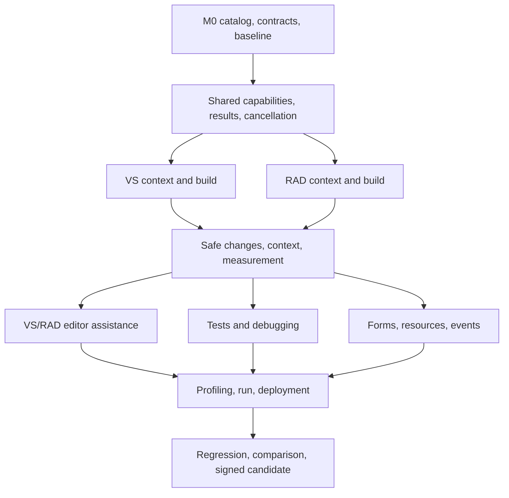

# PiAgent development plan for comprehensive IDE integration

The current 0.11.2 source and prior signed 0.11.1 validation scope are distinguished in [validation](VALIDATION.md) and the [0.11.2 release record](RELEASE-0.11.2.en.md). Hash `8A3A…FD09` below identifies the **earlier 0.11.0** upgrade/rollback/restoration package. Download hashes accompany each GitHub release asset (`.exe.sha256`).

[한국어](IDE-AGENT-ROADMAP.md) · **English** · [Documentation](README.md)

## Current status — scoped 0.11.2 prerelease source

The original goal is a **connected workflow** in both IDEs: understand the real project, apply reviewed edits, repair from build/test/debugger evidence, and recover safely. Version 0.11.2 source implements and verifies parts of that workflow in bounded fixtures. It does not meet every M0–M6 exit criterion or establish an automatic repair success rate across ordinary projects. The signed 0.11.1 fixture counts in the table are prior-release evidence; later source tests and validation of new signed assets are separate.

| Original workflow | Implemented and verified within scope | Connection still unproven |
|---|---|---|
| VS understand → edit → build → test → repair | An actual VS2026 WPF fixture passed 8/8 for context/catalog, targeted build, two-file rename/native Undo, stale-preview refusal, debugger and designer create/event/delete/restore. C#/VB Roslyn navigation, saved-state checks and reviewed edits exist. VSTest/TRX and an explicitly selected MTP CLI/TRX path exist; actual MTP pass/fail reports were checked. | No measured end-to-end run where a model reads a failure, edits repeatedly, reruns tests and completes a general project. MTP requires a framework; filter/runsettings and Test Explorer control are absent. Modern out-of-process WinForms public designer automation is outside scope. |
| RAD VCL/FMX inspect → change → event → build → restore | Exact signed Win32 and Win64 BPLs each passed VCL 11/11 and FMX 9/9 direct designer checks. Saved standard forms support reviewed create/delete/event and separately approved restore, bounded button Font changes and VCL TListView column captions. Native build, target-bound external Delphi build/diagnostics and conditional DUnitX execution exist. | Separate fixture steps do not prove one complete model repair loop in an arbitrary project or the FMX runtime font appearance. RAD native ghost/Tab, Delphi semantic refactoring, test discovery, locals/frame selection and general collection editing are absent. |
| Stop session → reconnect → resume safely | Stop drains persistence; disconnect/project switches retire old approvals, queued requests and catalogs. Late UI requests cannot alter drafts, URLs or approval cards, and a new request never automatically replays mutations. The 0.11.1 archived UI passed 93 WebView checks and deterministic lifecycle regression. An earlier actual IDE Stop→Retry→fresh `ide_context` roundtrip also passed. | That live roundtrip belongs to an earlier binary. Its brief model turn repeated a historical cancellation error, retained as a content failure. Version 0.11.1 has not been exercised across diverse models/network failures in a normal IDE profile. |

**Implemented with limited real-use evidence:** backend-specific profiling/comparison, scoped local publish, long-session recovery, physical IME/busy-UI and multi-file fault paths, and varied IDE workloads. Bounded context experiments do not establish causal speed or cost improvement. **Not implemented/supported:** RAD native ghost/Tab, semantic refactoring, native compiler-message enumeration/test discovery, arbitrary inherited/third-party forms or collection insert/delete/reorder, modern VS out-of-process WinForms designer and Test Explorer control, and remote deployment. An investigation did not find a public RAD compiler-message enumeration/subscription API, so only an explicit external build log is exposed as `source=external`; that does not prove every other missing feature is inherently impossible.

**Isolated 240-minute automated IDE runs 3/3 PASS:** after the user lifted the four-hour deferral, unreleased unsigned working-tree RAD13.2 Win64 FMX/VCL and VS2026 WPF ran in parallel. The unchanged verifier found both UTC and monotonic spans above 14,400 seconds; each run recorded 2,867 samples, 24 builds and zero errors. The consolidated `artifacts/ide-soak-20261010/verified-results.json` matches original receipts and adapter hashes. This covers automated IDE observation/builds, not four hours of human use, model inference/repair performance or the signed 0.11.1 binaries. Earlier 0.10.0 strict soak failures remain unchanged. **Matched Copilot/KAI measurements remain deferred.** Normal-profile 0.11.1 install/update/rollback and clean Windows/physical x64 installation were not performed. There is no formal comparison or all-domain superiority result.

The 0.11.0 counts and baseline table below are **historical records**. They are not added to, or substituted for, the current signed 0.11.1 evidence.

### 0.11.2 candidate source — separate from new signed assets

A VS VSTest multi-target path could overwrite TRX files and omit failing-framework
details. A source-only fix uses `LogFilePrefix` to retain distinct reports,
compares report count with the target-framework count evaluated without a build,
and aggregates test/failure totals. A nonzero CLI exit remains a failure. A .NET
9/10 fixture with its failure condition enabled produced two TRXs (one failure,
one pass) and exit 1; disabling it produced two TRXs (one pass each) and exit 0.
The VS console suite passed 95 checks. Report-count validation does not
independently verify which framework produced each report, and the fixture does not test a model
repairing code across a continuous workflow. This change is absent from the
signed 0.11.1 VSIX.

RAD now invalidates cached external diagnostics when another native or external
build starts, records a build request ID, log SHA-256 and state, and rejects cached
rows after a reported source file or project changes on disk or an IDE buffer is
dirty. Win32 and Win64 SDK smoke passed 11/11 each, including an actual E2003
failure followed by source-change invalidation/restoration. An isolated Win64 VCL
IDE fixture passed 28 steps and observed `available:false` for external diagnostics
after the next native build. This checks only whether files stayed unchanged
**since result collection**; it does not prove all compiler-time input bytes or
other dependencies were fresh. This change is absent from the released 0.11.1 BPL.

In the installed RAD13.2 `ToolsAPI.pas`, `IOTACompileNotifier` reports build
start/finish/result, while `IOTAMessageServices` provides message add/clear and
group management. No public enumeration/subscription API for existing compiler
message rows was found in the investigated interfaces. Native build outcome and
compiler diagnostic rows remain distinct; request an explicit external Delphi
build log when rows are needed. This is a finding about the investigated SDK
surface, not proof that every workaround or future API is impossible.

## Follow-up implementation and earlier records, 2026-10-10

After the 0.11.0 prerelease, the user requested three **GPT-6-sol** subagents,
working through session/editor stability, IDE/designer expansion, practical
validation and comparison preparation. **Both the four-hour test and measured competitor
comparison were deferred at that time**; three separate unsigned isolated 240-minute runs later passed, while competitor measurements remain deferred. Original failed soak records remain unchanged. These source
changes were not features of the earlier 0.11.0 installer; they are within the signed 0.11.1 scoped prerelease.

- Closing or changing a session retires old approvals, queued messages and IDE
  catalogs. Late prior-turn events cannot change drafts or resurrect approval UI.
  New requests distinguish historical cancellation/errors from current evidence;
  mutations are never automatically replayed.
  Transport loss closes the running card once. Late idle requests cannot change
  the draft, launch a URL or revive approval UI; idle login and notices still work.
- VS suggestions recheck generation, document, caret, IME and buffer during
  asynchronous display and acceptance. Read failures during multi-file save
  recovery no longer hide the original error or partial restoration. RAD checks
  changed selection/read-only state and the complete buffer after applying.
- Reviewed RAD property transactions now cover standard VCL/FMX `TButton`
  `Font.Name`/`TextSettings.Font.Family` and VCL `TListView.Columns[0..31]`
  `Caption`. Live property/operation gates and explicit approval
  apply. This does not add arbitrary components or collection insertion,
  deletion or reordering.
  FMX checks cover the stored Font value after reopening. With the default
  `StyledSettings.Family` enabled, the style controls the displayed font; clear
  that setting in the IDE to enable the override. Automatically changing that
  setting and observing the FMX runtime font are outside this validation scope.
- Actual VCL testing found restored files could disagree with the open designer's
  Font. The fix closes/reopens the saved form and verifies file bytes, live values
  and clean buffers. VCL passed 11 steps, FMX 9; authenticated Core routes passed
  16 VCL and 12 FMX scenarios. Receipt row totals, including approvals, are 24/18;
  approval rows are not counted as extra test scenarios.
- VS adds a separate CLI/TRX path for projects explicitly opting into
  Microsoft.Testing.Platform. An explicit framework is required; MTP filters and
  runsettings are unsupported in this path. This does not control Test Explorer.
- The [comparison protocol](IDE-BENCHMARK.en.md) defines 12 tasks × 5 repetitions
  per IDE and checks missing/failed/unsupported attempts and mismatched conditions.
  No formal comparison runs or superiority result are claimed.

Remaining: RAD native ghost/Tab, semantic refactoring, native compiler message
enumeration, test discovery, locals/frame selection; modern .NET WinForms public
designer automation; inherited/third-party forms and general collection editing;
broader physical IME/busy-UI usage; clean Windows/physical x64 installation;
remote deployment, broader profiling and matched Copilot/KAI comparison. Unified
result-envelope migration also remains incomplete. See [validation](VALIDATION.md)
for final counts and binary identities. The next dated paragraph and counts refer
to 0.11.0; the rest retains original milestone definitions and the baseline.

**Earlier 0.11.0 record (2026-10-09):** the baseline was 0.10.0. That scoped 0.11.0 candidate passed native recovery/replacement payload checks and actual upgrade/rollback/restoration; both original strict soak gates failed. This paragraph and the following 211/18/91 counts are not 0.11.1 results.

Latest full Core run: 212 total, **211 PASS, 0 FAIL, 1 optional native-RAD receipt skip** (159,524.7573 ms); final both-architecture adapter integration passed 18/18. Native WebView passed 91, including 12 transitions and recovery/Stop/draft-preservation checks. Core now drains checkpoint/timeline persistence on Stop; explicit Retry connection uses existing native Connect/resumeLast without prompt replay or policy changes. Independent Stop/composer Escape preserve unsent drafts; focused UI 36/36 passed. Recovery VSIX SHA256 `28904BA981EA0C85C08A5BA1E27042D53760BCB3D7EAB81BDAAB39C286345DEF` retains native DLL (SHA256 begins 6A3141) and RAD BPL bytes; six UI files changed from guidance. Actual native Stop→Retry preserved the draft/saved conversation and a fresh explicitly approved IDE context call passed. The intervening tiny turn's historical-error answer remains a separate content failure. Replacement installer `setup-20261009-154200`, SHA256 `8A3A5FAEC53F607A1B5932BBEB536BB699622C859D13478EE8903FF2468CFD09`, passed signed payload/runtime/policy checks; actual upgrade/rollback/restoration passed with 1,056/1,029/1,056 verified payload files respectively. Original benchmark 01/02 passed and 03 remains an operator-interrupted failure with two web-search scope violations. Formal comparison remains pending. Earlier evidence retains its original identity; no whole-plan completion is claimed.

The original VS soak fails the strict four-hour gate: UTC span 14,399.0635 seconds versus Stopwatch 14,400.176 seconds, with 2,869 samples, 24 builds and no recorded errors. Its unequal timestamp anchors do not justify changing the receipt or verifier; it is near-four-hour evidence, not a four-hour PASS. RAD also fails the unchanged strict gate: UTC 14,399.018 seconds versus monotonic 14,400.203 seconds, 2,871 samples, 24 builds and zero errors. Both receipts retain their original 0.10.0 identities and are not strict four-hour PASS results.

The following maps **current 0.11.1 scope** to the original milestones; it does not mark every exit criterion complete.

| Milestone | Scoped implementation/verification | Remaining gate or support boundary |
|---|---|---|
| M0 | Catalog/gating, bound approvals/lifecycle, contracts and fixtures | C1 uniform envelope intentionally deferred; retain adapter result shapes |
| M1 | Actual native context/build in both IDEs; explicit target-bound RAD external diagnostics | Native RAD compiler-message enumeration unsupported; broader workloads unverified |
| M2 | Revision/preview/apply/undo, bounded editor context and saved-session Stop→Retry→fresh IDE roundtrip | Broader dirty/IME/busy-UI/multi-file fault coverage; RAD ghost/Tab unavailable |
| M3 | Supported tests/debugger/profile paths have scoped actual receipts; VS VSTest and explicitly selected MTP CLI/TRX runs | Test Explorer control, MTP filter/runsettings, Delphi test discovery/locals/frame selection unavailable; no general repair-rate claim |
| M4 | WPF source, .NET Framework WinForms and direct standard VCL/FMX structural preview/apply/restore; reviewed RAD standard-button Font and VCL TListView caption mutation/persistence checks | General collection insert/delete/reorder, inherited/third-party/modern OOP scope unsupported; FMX runtime font appearance unverified |
| M5 | Backend-specific CPU/GC/counters, local publish, protected local Git and bounded-context measurements | Exploratory measurements do not establish causal speed/cost improvement; broader platforms/deployment deferred |
| M6 | Signed 0.11.1 setup checked 1,063 payload files; isolated VS WPF 8/8, RAD VCL/FMX 11/11 and 9/9 on each architecture, archived WebView 93; separate unsigned isolated 240-minute automated IDE observation/build runs 3/3 PASS | Normal-profile 0.11.1 install/update/rollback and physical x64 clean install unverified; prolonged human use and model repair performance unmeasured; formal comparison deferred. The actual 0.11.0 install cycle remains separate evidence |

## 1. Objective and principles

Enable agents to use the actual project, language, editor, designer, build, test, debugger, profiling and execution facilities of Visual Studio 2026 and RAD Studio 13.2. Form design is one domain of this broader objective. Improve task completion, correctness, responsiveness and recovery. Do not claim universal superiority over Copilot or Kai before comparative measurement.

- Reuse the Node/TypeScript Core, OMP, authenticated Named Pipe, C# VSIX, Delphi BPL and shared WebView. SDK calls stay in adapters.
- Verify a public API, demonstrate it in a small real-IDE experiment, then implement the product feature. A menu command does not establish an automation API.
- Report language/framework/version/bitness, workload/edition prerequisites and current execution availability. Do not offer unavailable operations as usable tools.
- Validate in isolated fixtures and IDE profiles, preserving unsaved buffers and user changes.
- Improve tool selection as well as tool coverage. Avoid sending every tool description and the whole project on every request.
- Preserve user model selection. **GPT-6.1 sol** is the model for development subagents; it does not mandate the OMP model used by PiAgent customers.

## 2. Historical starting point and current implementation

The table below records the original 0.10.0 starting point, not current unavailability. Current 0.11.1 adds typed catalog/state gating, expiring state-bound approvals, immutable semantic/designer previews, exact source/form recovery, bounded editor context, native RAD build/debugger, verified external DUnitX, CPU comparison, VS EventPipe GC/local publish and shared reviewed Git. RAD native ghost/Tab, Delphi semantic refactoring, native compiler-message enumeration and publish remain unavailable. Modern out-of-process WinForms is unavailable; WinUI3 is a source backend without visual-designer/runtime-app proof. See the candidate guide for exact language/framework bounds.

C1 preserves existing adapter result shapes, transport/session correlation and explicit provenance/uncertainty. A uniform result envelope is intentionally deferred to a separately negotiated capability and adapter migration; arbitrary reads, acknowledgements, stale diagnostics, `applied:false` or zero tests are never normalized into completed success. RAD implements bounded, inspected and separately approved `Font.Name`/`TextSettings.Font.Family` on standard VCL/FMX buttons and `TListView.Columns[0..31].Caption` on VCL, with mutation, persistence, reopen and restore verified in isolated IDEs. The earlier test-only Font loader established inspection alone and is not evidence for the current mutation. Arbitrary collection insert/delete/reorder or other properties remain unimplemented.

| Domain | VS2026 / 0.10.0 | RAD13.2 / 0.10.0 | Next scope |
|---|---|---|---|
| Project/editor context | Solution, projects, configuration, active unsaved buffer | Workspace binding, selection, designer context | Dependencies, platform, multi-document revisions, availability |
| Diagnostics/symbols | Error List, Roslyn C#/VB definitions/references/callers | No common semantic tool bridge | RAD diagnostics, language API feasibility, provenance/freshness |
| Safe code changes | Suggestion acceptance/undo, approved file changes | Approved files, existing designer properties | Semantic rename/code actions, multi-document preflight/recovery |
| Build | Solution build/rebuild | Existing build-menu path, no structured common tool | Targeted builds, asynchronous progress/completion/cancel/diagnostics |
| Tests | Selected .NET project through dotnet test/TRX | No dedicated tool | VS integration feasibility, RAD runner/result contracts |
| Debugging | Breakpoints, stepping, stack/locals, evaluation | No dedicated tool | State-aware control, threads/frames/exceptions, RAD bridge |
| Profiling | Modern .NET CPU with dotnet-trace | No dedicated tool | .NET memory/allocations, native collection feasibility |
| Inline/next edit | Native suggestions, one edit/current file | Not implemented | RAD editor integration, latency reduction, expanded scope |
| Designers | Existing DesignerTools, framework-dependent | VCL/FMX inspection, scalar properties, limited references/reparenting | Creation/deletion/events, complex properties, recovery |
| Run/deploy | Some debugger launch operations | General OMP/existing IDE paths | Launch configuration, devices, packaging discovery and bounded integration |
| Git/sessions | Shared approvals/checkpoints/save/resume | Same Core/UI | Buffer/disk/Git consistency, conflicts, recovery quality |

Evidence: [VS scope](VS-INTELLIGENCE.en.md), [RAD scope](RAD-DESIGNER-DIAGNOSTICS.en.md), [validation history](VALIDATION.md), [architecture](../ARCHITECTURE.md), [protocol](../PROTOCOL.md). When historical prose conflicts with current code and evidence, use current evidence and correct the stale prose.

Three GPT-6.1 sol subagents identified the following historical prerequisites in the initial read-only audit. Catalog filtering, approval expiry/state revalidation, designer cancellation, new VS documents and RAD Unicode/window conversion are now implemented and regression-tested; broader planned extensions remain subject to the gates below.

- Negotiation currently establishes bridge support, not actual SDK/language/project availability. IDE tools are all registered as `essential`; controls remain listed in plan mode and are rejected at execution. C0 must distinguish usable operations.
- `IdeBridge` approval lacks the expiry timer present in designer approvals and is not bound to target state. Prioritize expiry, state revalidation and designer cancellation propagation.
- Approved disk changes currently cover tracked UTF-8 files and bounded batches. Buffer undo, disk checkpoint restore and conversation restore differ. File creation/deletion/rename require explicit additional recovery semantics.
- Editor requests create an OMP process and pipe connection each time. Brand-new unsaved files are limited by the current disk-file gate. Measure each phase and explicitly address new documents in V4/R3.
- RAD reader/writer offsets use **UTF-8 bytes**, while suggestion offsets use UTF-16. Introduce conversion and Korean/emoji/CRLF tests rather than copying VS offset handling.

## 3. Shared tool contracts — C work packages

Extend rather than indiscriminately replace `ide.tools.v1`, `editor.suggestions.v1` and `ide.designer.v1`. Negotiate additive capabilities; use a separate version when changing existing semantics. Names below describe design work packages, not RPC method names; the implemented wire contract is [IDE-CATALOG-CONTRACT.md](IDE-CATALOG-CONTRACT.md).

| ID | Deliverable | Completion criteria |
|---|---|---|
| C0 | Feature catalog/status: operation ID, implementation version, languages/frameworks, availability/blocking reason, required state | Exclude unsupported languages, missing tools and disconnected services from actionable tools; preserve old adapter connectivity |
| C1 | Original goal: common result IDs, revision, target, time, states and truncation. Current compatibility adjustment: preserve adapter result shapes/correlation/provenance; defer a uniform envelope to separate capability migration | Distinguish acknowledgement from completion; never invent completed success for failed reads, stale diagnostics or zero tests; uniform-schema migration remains uncompleted |
| C2 | Changes: preview, target/revision preflight, existing consent policy, post-validation, undo/compensating recovery outcome | Reject changes after approval when revisions differ; disclose partial failure; do not promise atomicity without recovery proof |
| C3 | Lifecycle: approval expiry, progress/time limits, project switches, disconnect, session ownership, child cleanup | No duplicate execution or cross-project results; distinguish cancellation before execution, stopped execution and already-applied changes; fault-test child trees before adding ownership controls |
| C4 | Context/measurement: relevant tools/symbols, revision cache, size budgets, phase latency/cost | Invalidate stale data; measure bottlenecks without logging secrets or source payloads |

Debugger inspection can execute property getters: separate non-evaluating snapshots from explicit evaluation. Build/test/run can execute project code and are not read-only. Preserve current plan/read-only and approval choices without adding redundant confirmations to every step.

Use preflight → preview → approval → apply → validate for document sets. Distinguish native undo, file checkpoints and compensating restoration. Debugger continuation and external deployment cannot be undone by document undo. A disconnected request must not be automatically replayed when execution may already have happened.

Follow SDK thread rules: capture/apply required state on the UI thread and perform long inference/process waits elsewhere. RAD workers exchange JSON/values rather than retaining live ToolsAPI/component interfaces. Resolve targets again at execution and remove notifiers/callbacks on package unload.

## 4. IDE implementation work packages

### Visual Studio

| ID | Scope | Dependencies and acceptance |
|---|---|---|
| V0 | Connect existing tools to C0/C1; discover solution, languages, SDKs and state | C0/C1; existing C#/VB/build/debug behavior retained |
| V1 | Rich document/symbol context, C#/VB semantic rename and bounded code actions | C2; immutable multi-file preview, path/dirty/revision conflicts, undo and recovery |
| V2 | Project/configuration builds, cancellation, fresh diagnostics; richer test targeting/results | C1/C3; actual success/failure/cancel; verify supported Test Explorer API first |
| V3 | Debugger state machine, threads/frames, exception/evaluation policy, reproduction workflow | C1/C3; running/paused races, evaluation limits, clean session exit |
| V4 | Measure/reduce suggestion latency, select context, new unsaved documents, improve next edits | C4; IME, rapid typing, cancellation, undo, provider coexistence; cross-document edits follow C2 |
| V5 | Before/after CPU analysis, .NET memory/allocations, native C++ collection research | V3/C4; disclose runtime/tool/overhead limits; unsupported backends remain unavailable |
| V6 | WPF/XAML, WinForms, resources, run/publish configuration and Git workflows | C2 and framework-specific API experiments; distinguish text edits from designer control; isolated local deployment |

C++ semantics cannot be assumed to use C#/VB Roslyn. Investigate its public language service separately. Label CLI/document-edit fallbacks honestly where Test Explorer or designer APIs cannot be demonstrated.

Installed SDK metadata confirms Roslyn `Renamer`, `Formatter`, `Simplifier`, `Workspace.TryApplyChanges` and light-bulb enumeration APIs. However, `ISuggestedAction.GetPreviewAsync` may return UI rather than a machine-readable change set. Start with deterministic Roslyn operations whose changes can be previewed. The WinForms Designer SDK does not prove generic automation of the modern .NET out-of-process designer.

### RAD Studio

| ID | Scope | Dependencies and acceptance |
|---|---|---|
| R0 | Common IDE tool bridge; project group, active project, platform/configuration, unsaved buffers | C0/C1; separate connection/workspace, safe project switches |
| R1 | Asynchronous compile/build, progress/result/cancel, proven diagnostic acquisition | R0/C3; `IOTACompileServices` and compile notifiers; distinguish dispatch/completion; identify diagnostic source |
| R2 | Debugger state/breakpoints/stack/locals/step and test runners | R0/C3; verify ToolsAPI debugger; validate each DUnitX/DUnit runner output/exit contract |
| R3 | Inline/next-edit integration, Tab/Esc/Undo/IME | R0/C4; prove public editor integration; use explicit preview/acceptance where native suggestion lifecycle is unavailable |
| R4 | VCL/FMX creation/deletion/event wiring and designer recovery | C2/R0; verify source declarations/resource synchronization and failure recovery beyond API existence |
| R5 | Nested properties/collections, menus/actions, inherited forms, data modules, third-party controls | R4; supported-type adapters, cycles/references/read-only/inheritance constraints |
| R6 | Semantic navigation/refactoring, native profiling, run/devices/deployment/resources | Public API experiments; distinguish Delphi/C++Builder; LSP existence does not prove an extension query interface |

Installed RAD13.2 ToolsAPI confirms `IOTAFormEditor.CreateComponent`, `IOTAComponent.Delete`, `IDesigner.CreateMethod/RenameMethod`, undoable source writers and compile services. This is feasibility evidence, not proof of native multi-operation undo or arbitrary component support.

`IOTAMessageServices` supports message publication/group management; no public enumeration/subscription for existing compiler diagnostics was located. Separate native build success/failure from diagnostic acquisition. If IDE log collection cannot be proved, expose a deliberate external MSBuild/dcc log build with `source=external`, configuration/platform and saved-state restrictions. Do not describe it as direct IDE error-window access.

`ToolsAPI.Editor` exposes notifiers, input and paint hooks, but a native inline-provider lifecycle is unconfirmed. Implement preview/accept/undo first; provide ghost text only after IME/DPI/CodeInsight coexistence tests. Use `IOTADebuggerServices`/`IOTAProcess`/`IOTAThread` with deferred evaluation and 64-bit address checks. DUnitX NUnit XML is an external-runner result, not IDE test-explorer integration.

`DeployManagerProject` returning does not establish deployment completion. Start with manifest/output/platform inspection and prove completion/error reporting before execution. Distinguish Git provider registration from Git command APIs and CodeInsight provider APIs from semantic refactoring services.

## 5. Sequence and parallel work

Reorder tasks within a milestone as evidence develops, while preserving dependencies. Assign release numbers/dates after completion gates, not in advance.

| Milestone | Core/shared | VS | RAD | Exit criteria |
|---|---|---|---|---|
| M0: establish foundation | C0/C1 design, lifecycle and latency baseline | V0/API experiments | R0/R1 experiments | Catalog, contracts, fixtures, baseline agreed |
| M1: actual context→build | C0/C1/C3 implementation | V0/build portion of V2 | R0/R1 | Inspect→change→build→actual result/diagnostics in both IDEs |
| M2: safe changes/editor | C2/C4, latency instrumentation | V1/V4 | R3 | Revision, cancellation, undo, IME and availability gates |
| M3: runtime evidence | Long-running state/results | V2 tests/V3 | R2 | Repair using failing tests or debugger evidence and revalidate |
| M4: designers | Shared preview/recovery | Designer part of V6 | R4 then R5 | UI/source/event consistency, failure recovery, actual execution |
| M5: performance/platforms | Measurement comparison, cost/context tuning | V5/rest of V6 | R6/rest of R5 | Measured improvement and scoped support matrix |
| M6: compare/package | Regression, documentation, compatibility, packaging | VS live/competitive evaluation | RAD live/competitive evaluation | Evidence-backed signed candidate, install/update/restore checks |

Later API experiments and fixtures can proceed in parallel after M0. Do not integrate destructive designer or multi-file mutation features before C2. M6 accumulates verification from earlier milestones rather than postponing all validation.



## 6. GPT-6.1 sol subagent execution

Current concurrency is **one coordinator plus three subagents**. Set every implementation subagent to **GPT-6.1 sol**. Reuse or rotate agents by work package; separate user-facing threads are unnecessary.

| Role | Default exclusive ownership | Responsibility |
|---|---|---|
| Coordinator | Integration points, shared UI, docs, build/release wiring | Freeze contracts, assign work, review/integrate, live acceptance, resolve conflicts |
| A: Core/contracts | `packages/piagent-protocol`, `packages/piagent-core`, `packages/piagent-omp`, related Node tests | Negotiation, brokering, state/cancel/context/model execution; rotate to validation after completion |
| B: VS | `adapters/visualstudio`, VS-specific fixtures | VS SDK implementation and tests |
| C: RAD | `adapters/radstudio`, RAD-specific fixtures | ToolsAPI implementation, Delphi fixtures, VCL/FMX verification |

- Each assignment includes the input contract, exact writable/excluded files, dependencies, test commands and required evidence. Never concurrently edit shared files.
- Freeze contracts before A edits `chat.ts`/`index.ts` and the coordinator edits UI integration. B/C develop against approved contract fixtures.
- Prefer explicit ownership in the shared workspace. Use `codex/` branches and isolated worktrees when longer-lived separation is necessary, integrating by milestone.
- Parallelize editing and independent tests. Serialize shared build outputs, version generation, packaging, signing, installation and physical IDE UI operations.
- Subagents do not independently redesign shared contracts, bump versions, install or publish. Report justified scope changes to the coordinator.
- Integrate small work packages and run relevant regressions. Three workers do not imply exactly threefold speedup.

## 7. First implementation handoff — M0/M1

1. **Coordinator:** record 0.10.0 baseline, installed IDE/API versions, C0/C1 definitions and stable feature IDs. Correct stale present-tense protocol/adapter documentation.
2. **A:** design and test capability-based descriptions/approval display in `ide-tools.ts`, preserving compatibility. Implement per-connection availability, reasons, freshness and cancellation/late-reply cases.
3. **B:** connect existing VS tools to feature/state reporting. Add document/project identity and diagnostic revision/provenance/build identity. Verify existing behavior.
4. **C:** implement RAD context/build in separate units such as `PiAgent.IdeHost.pas`, `PiAgent.IdeContext.pas`, `PiAgent.IdeBuild.pas`; prove a diagnostic acquisition path. RAD alone owns PipeClient/ChatForm wiring. Test notifier teardown and project switching.
5. **Coordinator:** expose available tools, blocking reasons and progress/completion in Korean/English shared UI. Verify context→build→diagnostics using real fixtures in both IDEs.

The first batch is complete when **both IDEs provide actual project context and compile outcomes under consistent tool semantics, clearly separating unsupported, cancelled and stale results**. If structured RAD IDE diagnostics remain unproven, retain the explicit limitation and separately identified external build path; do not mark native diagnostic integration complete. Avoid starting with one release containing every planned feature.

## 8. Validation and comparative measurement

### Milestone gates

- Core: negotiation, old adapters, input/output bounds, workspace isolation, approval/decline/plan mode, cancellation, late replies and disconnect.
- Editing: dirty/revision conflicts, rapid typing, UTF-16/Korean IME, Tab/Esc, Undo/Redo, switching documents and partial multi-document failure.
- RAD: real Win64 IDE first. Report Win32 build/transport separately from live UI. Distinguish VCL/FMX and Delphi/C++Builder.
- VS: start with C#/.NET, then VB/C++/WPF/WinForms. Preserve existing VS2022 17.14 compatibility.
- Sessions: plan 10 project/session switches, 30 cancel/resume cycles and 100 consecutive editor requests to detect context mixing, stale application and owned-process leaks. Run a four-hour real-IDE workflow with recorded waiting/model delay/interruption causes. These are planned gates, not current PASS claims.
- Designers: create→properties→events→build→run→restore; separate deletion/failure/inheritance/reference/multi-document fixtures.

Reuse existing validation. Multiple agents must not run these full commands concurrently.

```powershell
npm test
npm run test:adapters
dotnet run --project adapters/visualstudio/PiAgent.Vsix.Tests/PiAgent.Vsix.Tests.csproj -c Release
node scripts/test-docs.mjs
node scripts/test-website.mjs
```

Follow existing arguments/environment requirements for `scripts/build-adapters.ps1`, `scripts/build-installer.ps1`, `scripts/sign-artifacts.ps1` and `scripts/verify-installed-native.mjs`. Extend `scripts/vs-intelligence-acceptance.mjs`, the Delphi harnesses and `scripts/test-gui-harness.ps1`. Distinguish scripted/mock verification from observed real IDE UI outcomes.

Build C#/Delphi harnesses before `npm run test:adapters`. Recorded full Core and adapter checks took approximately 134 and 32 seconds respectively; environment changes affect duration. The existing >10-minute `scripts/test-long-running.mjs` and planned four-hour live run serve different purposes. Persistent inference processes are conditional on proved reset/session isolation.

### Copilot/Kai comparison protocol

Prepare at least 12 tasks per IDE covering code comprehension, small changes, multi-file refactoring, build repair, tests, runtime bugs, performance and form/resource work. Record language/framework scope per task: VS C#/VB/C++ and supported UI frameworks; RAD Delphi/C++Builder and VCL/FMX.

- During development use two representative tasks per IDE. For milestone comparison repeat each task five times, alternate execution order and restore the same fixture each run.
- Use the same PC, IDE, repository, prompt, time budget and permissions. Separate matched-model comparisons from default product-experience comparisons. If completion models cannot be matched, report product experience rather than model-controlled performance.
- Record completion rate, independent hidden functional/regression tests, edits, user intervention, total duration, first useful suggestion, p50/p95 latency, tokens/cost and CPU/memory. Unavailable usage data is unknown, not zero.
- Separate model delay from IDE/transport overhead and cold from warm runs. Compare speed for equivalently successful outcomes and also publish failures/timeouts.
- Five repetitions per task are exploratory, not a stable task-specific p95 estimate. Report p95 only for sufficiently sampled comparable operation/task groups; otherwise publish individual runs, range and sample size. Do not combine unlike tasks into a single latency percentile to claim superiority.
- Separate tuning tasks from final evaluation; publish sample size and uncertainty. Do not reinterpret a single 2.4-second request or internal regression pass rate as comparative performance.
- Scope superiority claims to the measured IDE/language/task/model/conditions. Unsupported tasks cannot count as successes.

## 9. Explicit research gates

| Area | Decision method | Bounded alternative |
|---|---|---|
| RAD ghost text/semantics | Installed ToolsAPI, official docs, real IDE experiment | Explicit preview; label lexical search accurately |
| VS Test Explorer/designer automation | Supported public APIs and workload-specific experiment | dotnet test/TRX, supported document edits |
| RAD/VS native CPU/memory | Tool/API/runtime and symbolization experiment | Supported external collector; unavailable when absent |
| Reusing OMP inference processes | Measure initialization, prove reset/workspace/tool/model isolation | Keep isolated processes; improve connections/context/model choice |
| Designer undo/third-party controls | Restore actual state, resource and source | Limit supported types; explicit compensation or refusal |
| Database/data connections/devices/remote deployment | Inventory APIs, credential boundaries and external effects | Begin with metadata and isolated local targets |

These are assigned research tasks, not silently omitted promises. Do not rely on private APIs for the default release path. UI automation can assist acceptance testing but is distinct from an SDK-backed product tool.

## 10. Deliverables and reporting

Each work package delivers implementation, relevant regression tests, live verification evidence, Korean/English documentation and support-boundary changes. Reports include completed/in-progress/blocked work, changed files or commits, checks performed and next dependencies.

Create integrated signed candidates after milestone review; verify installation/update and prior-version recovery. Publish only verified scope in README, website and release notes. Planning alone does not bump the product version or add unimplemented features to the support list.

## 11. Implementation evidence and references

- Local RAD13.2 public SDK: `ToolsAPI.pas`, `DesignIntf.pas`, `ToolsAPI.Editor.pas` and `DeploymentAPI.pas` under `C:\Program Files (x86)\Embarcadero\Studio\37.0\source\ToolsAPI`. Installed APIs do not certify other versions.
- Current VS adapter targets .NET Framework 4.7.2, VS SDK 17.14.40265 and Roslyn 4.14.0. Preserve this public SDK foundation under [VS2026 extension compatibility](https://learn.microsoft.com/en-us/visualstudio/extensibility/migration/extension-compatibility?view=visualstudio).
- [Roslyn rename](https://learn.microsoft.com/en-us/dotnet/api/microsoft.codeanalysis.rename.renamer.renamesymbolasync?view=roslyn-dotnet-5.0.0), [VS build manager](https://learn.microsoft.com/en-us/dotnet/api/microsoft.visualstudio.shell.interop.ivssolutionbuildmanager2?view=visualstudiosdk-2022), [Debugger2](https://learn.microsoft.com/en-us/dotnet/api/envdte80.debugger2?view=visualstudiosdk-2022). Verify signatures against the actual installed reference version.
- [Light-bulb providers](https://learn.microsoft.com/en-us/visualstudio/extensibility/walkthrough-displaying-light-bulb-suggestions?view=visualstudio), [WinForms designer differences](https://learn.microsoft.com/en-us/dotnet/desktop/winforms/controls-design/designer-differences-framework), [WinUI runtime UI tools](https://learn.microsoft.com/en-us/windows/apps/develop/ui/xaml-runtime-design-tools). Do not confuse WinUI3 runtime XAML tools with a drag-and-drop designer.
