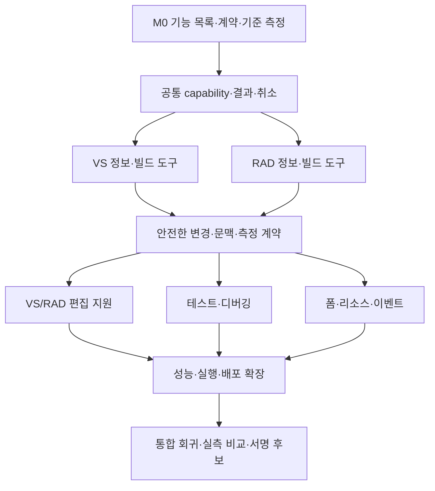

# IDE 전체 기능을 활용하는 PiAgent 개발 계획

**한국어** · [English](IDE-AGENT-ROADMAP.en.md) · [문서 목록](README.md)

작성일: 2026-10-09. 과거 출발점: **0.10.0**, 현재 소스: **0.11.0 후보**. 상태: **M0~M6 검증 진행 중이며 최종 안내 패키지 검사 통과·실제 설치/soak/게시 대기**.

최신 전체 Core 검사는 총 209개 중 **208 PASS, 실패 0, 선택 네이티브 RAD receipt skip 1**이며 양쪽 아키텍처의 최종 어댑터 통합 18/18을 통과했다. 네이티브 WebView 82개에는 전환 12개와 승인 표시/값 보존 새 검사 3개가 포함된다. UI만 다시 패키징한 VSIX는 정확히 같은 네이티브 DLL과 제한된 VS2026/VS2022 검증 근거를 유지한다. 서명 RAD release011b도 BPL 해시와 VCL/FMX 디자이너 6/SDK 26/Core 8 시나리오·생성 단계 여섯 개 빌드를 유지한다. 이후 공용 RAD UI 스크립트 2개만 바뀌었고 공용 UI 검증을 별도로 통과했다. 최종 안내 설치파일(setup-20261009-134700)의 payload/runtime/정책 검사를 통과했다. 구현 checkpoint 24c51e7은 로컬 커밋이며 push하지 않았다. 이전 근거의 실제 바이너리 식별자는 유지한다. 4시간 soak, 실제 설치/업데이트/복구와 조건을 맞춘 비교 측정은 별도 대기 조건이다. [검증 기록](VALIDATION.md)과 [후보 안내](IDE-AGENT-INTEGRATION.md)를 따르며 계획 전체 완료를 뜻하지 않는다.

## 1. 목표와 개발 원칙

Visual Studio 2026과 RAD Studio 13.2가 가진 프로젝트·언어 서비스·편집·디자이너·빌드·테스트·디버거·성능 분석·실행 도구를 AI가 실제 증거에 따라 사용하도록 한다. 폼 디자이너는 이 목표의 한 영역이다. 목표는 작업 완료율, 정확성, 응답성, 복구 능력 개선이며, Copilot·Kai보다 전 영역에서 우수하다는 주장은 비교 측정 전에는 하지 않는다.

- 현재 Node/TypeScript Core, OMP, 인증된 Named Pipe, C# VSIX, Delphi BPL, 공용 WebView 구조를 재사용한다. IDE SDK 호출은 adapter에 둔다.
- 설치된 공개 API → 작은 실제 IDE 검증 → 제품 구현 순서다. 메뉴의 존재를 자동화 API의 존재로 간주하지 않는다.
- 기능별로 언어, 프레임워크, IDE 버전·비트 수, 필요한 워크로드·에디션, 실행 상태를 표시한다. 사용할 수 없는 기능을 AI에 사용 가능하다고 알리지 않는다.
- 기존 사용자 프로젝트 대신 독립 fixture와 IDE 시험 프로필에서 검증한다. 미저장 내용과 사용자 변경을 보존한다.
- 도구 추가와 도구 선택 품질을 함께 개선한다. 모든 도구 설명·프로젝트 내용을 매번 모델에 보내지 않는다.
- 작업별 모델 선택은 유지한다. 이번 개발에 사용하는 서브에이전트 모델 **GPT-6.1 sol**과 PiAgent 사용자가 선택할 OMP 모델은 별개다.

## 2. 과거 출발점과 현재 구현

아래 표는 원래 0.10.0 출발점이며 현재 미지원 목록이 아니다. 현재 0.11.0은 typed catalog/상태 제한, 만료·상태 결합 승인, 불변 의미/디자이너 미리보기, 정확한 소스/폼 복구, 제한된 편집기 문맥, RAD 네이티브 빌드/디버거·검증 외부 DUnitX·CPU 비교, VS EventPipe GC/로컬 publish와 공통 승인 Git을 구현했다. RAD native ghost/Tab·Delphi 의미 refactor·네이티브 compiler 메시지 열거·publish는 미지원이다. 최신 out-of-process WinForms는 미지원이며 WinUI3는 visual designer/실행 앱 검증이 없는 소스 backend다. 정확한 언어/프레임워크 조건은 후보 안내를 따른다.

C1은 기존 어댑터 결과 형태, 전송/세션 대응과 명시적 출처·불확실성을 유지한다.
통일 결과 envelope는 별도 capability 협상과 어댑터 이관까지 의도적으로 보류한다.
임의 조회, ACK, 오래된 진단, `applied:false`나 테스트 0개를 완료 성공으로 정규화하지
않는다. RAD 중첩 scalar 속성(제한된 Font 필드 포함)은 구현됐으나 실제 Font 검증은
남아 있으며 collection authoring은 구현하지 않았다.

| 영역 | VS2026 / 0.10.0 | RAD13.2 / 0.10.0 | 다음 범위 |
|---|---|---|---|
| 프로젝트·편집 문맥 | 솔루션·프로젝트·설정·활성 미저장 코드 | 프로젝트 바인딩·선택 코드·디자이너 문맥 | 의존성, 대상 플랫폼, 복수 문서 revision, 기능 상태 |
| 진단·심볼 | 오류 목록, Roslyn C#/VB 정의·참조·호출자 | 공통 의미 기반 도구 미연결 | RAD 진단, 언어별 탐색 API 확인, 결과의 출처·신선도 |
| 안전한 코드 변경 | 제안 수락·undo, 승인 파일 변경 | 승인 파일 변경, 기존 디자이너 속성 변경 | 의미 기반 rename/code action, 여러 문서 사전검사·복원 |
| 빌드 | 솔루션 build/rebuild | 기존 빌드 메뉴 경로; 구조화된 공통 도구 미연결 | 대상별 빌드, 비동기 진행·종료·취소·진단 |
| 테스트 | 선택 .NET 프로젝트의 dotnet test/TRX | 전용 도구 없음 | VS 테스트 통합 가능성 검증, RAD 테스트 러너·결과 계약 |
| 디버깅 | 중단점·단계 실행·stack/locals·평가 | 전용 도구 없음 | 상태 기반 제어, 스레드·프레임·예외 정보, RAD 연결 |
| 성능 분석 | 최신 .NET의 dotnet-trace CPU | 전용 도구 없음 | .NET 메모리·할당, 네이티브 측정 수단 검증 |
| 인라인·다음 수정 | VS native suggestions, 현재 문서 한 수정 | 미구현 | RAD 편집기 통합, 지연 감소, 후속 범위 확대 |
| 디자이너 | 기존 DesignerTools 경로; 프레임워크별 차이 있음 | VCL/FMX 조회·scalar 속성·일부 참조·부모 변경 | 생성·삭제·이벤트·복잡한 속성·안전한 복원 |
| 실행·배포 | 일부 디버거 실행 | 일반 OMP/기존 IDE 경로 | 실행 구성·장치·패키징 기능 조사 및 제한된 통합 |
| Git·세션 | 공통 승인·checkpoint·저장·재개 | 같은 Core/UI 이용 | IDE 버퍼와 Git 일치, 충돌 작업, 복구 품질 강화 |

주요 근거: [VS 범위](VS-INTELLIGENCE.md), [RAD 범위](RAD-DESIGNER-DIAGNOSTICS.md), [검증 기록](VALIDATION.md), [구조](../ARCHITECTURE.md), [프로토콜](../PROTOCOL.md).
과거 설명이 남은 문서와 실제 코드가 다르면 최신 코드·검증 근거로 판정하고 해당 설명도 정리한다.

초기 GPT-6.1 sol 3개 에이전트의 읽기 전용 코드/SDK 조사에서 확인했던 선행 과제는 다음과 같다. 기능 필터, 승인 만료/상태 재검사, 디자이너 취소, 새 VS 문서와 RAD Unicode/문맥 창 변환은 현재 구현·회귀 검증됐으며 더 넓은 확장은 아래 조건을 따른다.

- 현재 협상은 bridge 지원을 나타내며 실제 언어·프로젝트·SDK 가용성을 보증하지 않는다. 모든 IDE 도구가 `essential`로 등록되고 계획 모드의 실행 도구도 목록에는 남는다. C0에서 실제 사용 가능한 작업을 구분한다.
- `IdeBridge` 승인은 기존 designer 승인과 달리 만료 타이머가 없고 실행 대상 상태와 결합되지 않는다. 승인 만료·상태 재검사·designer 취소 전달을 우선 보강한다.
- 승인 파일 변경은 현재 추적 중인 UTF-8 파일과 작은 batch로 제한된다. IDE 버퍼 undo, 디스크 checkpoint, 대화 복원을 구분하고 생성·삭제·rename까지 지원 범위를 넓힐 때 별도 복구 계약을 추가한다.
- 편집기 제안은 매번 OMP와 pipe 연결을 준비하며 디스크에 없는 새 문서는 현재 경로에서 제한된다. 단계별 지연과 새 문서 지원을 V4/R3의 명시적 작업으로 둔다.
- RAD 편집기 reader/writer는 UTF-8 **바이트 위치**, 공통 제안 계약은 UTF-16 위치를 사용한다. 변환 계층과 한글·emoji·CRLF 시험 없이 VS 위치 처리를 그대로 재사용하지 않는다.

## 3. 공통 도구 계약 — C 작업 묶음

기존 `ide.tools.v1`, `editor.suggestions.v1`, `ide.designer.v1`을 무조건 교체하지 않는다. 호환되는 확장은 추가 capability로 협상하며, 기존 호출의 의미가 바뀌면 별도 버전으로 제공한다. 아래 명칭은 설계 작업 항목이며 RPC 메서드 이름이 아니다. 실제 구현 wire 계약은 [IDE-CATALOG-CONTRACT.md](IDE-CATALOG-CONTRACT.md)를 따른다.

| ID | 작업 | 완료 기준 |
|---|---|---|
| C0 | 기능 목록·상태 계약: feature ID, 구현 버전, 지원 언어/프레임워크, 가용 여부·차단 이유, 필요한 실행 상태 | 미지원 언어·미설치 도구·미연결 IDE 기능을 사용 가능 목록에서 제외; 구 adapter 연결 유지 |
| C1 | 원래 목표: 공통 결과 ID·revision·대상·시점·상태·잘림. 현재 호환성 조정: 어댑터 결과 형태/대응/출처 유지, 통일 envelope는 별도 capability 이관까지 보류 | ACK와 완료를 구분; 조회 실패·오래된 진단·빈 테스트를 완료 성공으로 만들지 않음; 통일 schema 이관은 미완료 |
| C2 | 변경 계약: preview, 대상·revision 사전검사, 기존 승인 정책 적용, 실행 후 확인, undo/보상 복원 결과 | 승인 후 변경된 문서에는 적용 금지; 부분 실패 명시; 복원 가능성이 없는 작업에 원자적 적용을 약속하지 않음 |
| C3 | 수명·취소: 승인 만료, IDE 작업 진행, 시간 제한, 프로젝트 교체, 연결 종료, 세션 소유권, 자식 프로세스 정리 | 중복 실행·이전 프로젝트 결과 혼입 없음; 취소 전 미실행/실행 중단/이미 적용됨을 구분; 자식 트리 누수 재현 시험 후 필요한 수명 제어 보강 |
| C4 | 문맥 선택·측정: 필요한 도구/심볼만 선택, revision 기반 캐시, 크기 예산, 단계별 지연·비용 기록 | 낡은 캐시 무효화; 비밀·소스 본문을 진단 로그에 남기지 않고 병목 구분 가능 |

디버거 변수 조회도 속성 평가로 사용자 코드를 실행할 수 있다. 부작용 없는 스냅샷과 명시적 평가를 구분한다. 빌드·테스트·실행은 프로젝트 코드를 실행할 수 있으므로 단순 읽기로 분류하지 않는다. 기존 읽기 전용/계획 모드와 승인 선택을 보존하며 모든 단계에 새 승인창을 무조건 추가하지 않는다.

수정 가능한 문서 집합에 대해 사전검사 → 미리보기 → 승인 → 적용 → 검증을 수행한다. IDE마다 undo 모델이 다르므로 native undo, 파일 checkpoint, 보상 복원을 구분한다. 디버거 계속 실행·외부 배포 같은 부작용은 문서 undo로 되돌릴 수 있다고 표시하지 않는다.
연결이 끊기기 전에 실행되었을 가능성이 있는 요청은 재연결 때 자동으로 재실행하지 않는다.

SDK의 스레드 규칙에 따라 UI thread에서 필요한 정보만 캡처·적용하고 긴 추론·프로세스 대기는 밖에서 처리한다. RAD worker에는 JSON/값만 전달하고 살아 있는 ToolsAPI/component 인터페이스를 보관하지 않는다. 실행 시 대상을 다시 확인하며 패키지 unload에서 notifier·callback을 제거한다.

## 4. IDE별 구현 작업

### VS 작업 묶음

| ID | 내용 | 선행 조건·검증 |
|---|---|---|
| V0 | 기존 도구를 C0/C1과 연결; 솔루션 구성·언어·SDK·상태 확인 | C0/C1. 기존 C#/VB, 빌드·디버거 경로 회귀 없음 |
| V1 | 문서·심볼 문맥 확대, C#/VB 의미 기반 rename 및 제한된 code action | C2. Roslyn 변경 집합 미리보기, 범위 밖 파일 거절, dirty/revision 충돌, 다중 문서 undo 검증 |
| V2 | 프로젝트/구성별 빌드·취소·진단 신선도, 테스트 탐색·선택·결과 강화 | C1/C3. 실제 성공·실패·취소 결과; Test Explorer API의 공개 지원 여부를 먼저 검증 |
| V3 | 디버거 상태 머신, 스레드·프레임 선택, 예외/평가 정책, 실패 재현 흐름 | C1/C3. 실행/중단 상태 경합, 평가 시간 제한, 세션 종료 검증 |
| V4 | 인라인 지연 측정·개선, 문맥 선별, 새 미저장 문서, 수정 위치 예측 개선 | C4. IME·빠른 타이핑·취소·Undo·다른 제안 공급자와 공존; 다중 문서 제안은 C2 이후 별도 적용 흐름 |
| V5 | CPU 결과의 전후 비교, .NET 메모리·할당 진단; 네이티브 C++ 측정 수단 조사 | V3/C4. 도구·런타임 제약과 수집 부하 표시; 공개 지원 수단이 없으면 미지원 유지 |
| V6 | WPF/XAML·WinForms·리소스·실행/게시 구성·Git 작업 통합 | C2 및 프레임워크별 API 검증. 일반 텍스트 편집과 실제 디자이너 조작을 구분; 임시 로컬 배포 대상에서 검증 |

VS C++의 심볼·리팩터링은 C#/VB Roslyn 구현을 재사용할 수 있다고 가정하지 않는다. C++ 공개 언어 서비스의 실제 지원을 먼저 조사한다. 공개 API가 없는 Test Explorer·디자이너 기능은 지원되는 CLI/문서 편집 경로를 별도 표시하며 내부 API나 단순 메뉴 실행을 완전한 통합으로 포장하지 않는다.

설치 SDK에서 Roslyn `Renamer`/`Formatter`/`Simplifier`/`Workspace.TryApplyChanges`와 VS light-bulb 열거 API를 확인했다. 다만 일반 `ISuggestedAction.GetPreviewAsync`의 결과는 기계가 검토할 변경 집합이 아닌 UI일 수 있다. 따라서 최초 code action은 변경 내용을 미리 계산할 수 있는 Roslyn 작업으로 제한한다. WinForms Designer SDK의 존재만으로 최신 .NET의 외부 프로세스 디자이너를 조작할 수 있다고 가정하지 않는다.

### RAD 작업 묶음

| ID | 내용 | 선행 조건·검증 |
|---|---|---|
| R0 | `ide.tools` 연결, 프로젝트 그룹·활성 프로젝트·플랫폼·구성·미저장 문서 문맥 | C0/C1. VS와 별도 연결·workspace, 프로젝트 전환 후 잘못된 대상 접근 없음 |
| R1 | 비동기 compile/build, 진행·결과·취소, 진단 수집 경로 검증 | R0/C3. 공개 `IOTACompileServices`와 compile notifier 검증; 빌드 명령 접수와 종료 분리; 구조화된 메시지는 수집 경로·출처를 입증한 범위만 제공 |
| R2 | 디버거 상태·breakpoint·stack·locals·step, 테스트 러너 연결 | R0/C3. ToolsAPI debugger 인터페이스 확인; DUnitX/DUnit 등은 지원 러너별 출력·종료 규약 검증 |
| R3 | 편집기 인라인 제안·다음 수정·Tab/Esc/Undo·IME | R0/C4. 공개 편집기 확장 API 검증 후 native 경로 선택; 미지원 시 명시적인 미리보기/수락 경로로 제한 |
| R4 | VCL/FMX 컴포넌트 생성·삭제·이벤트 연결 및 디자이너 변경 복원 | C2/R0. 생성·삭제·메서드 생성 API 존재 확인; 소스 선언·폼 리소스 동기화와 실패 복구를 실제 IDE에서 검증 |
| R5 | 중첩 속성·컬렉션·메뉴/Action·상속 폼·데이터 모듈·서드파티 컴포넌트 | R4. 지원 타입 목록과 변환 규칙, 순환 참조·외부 참조·읽기 전용·상속 제약 검사 |
| R6 | 의미 기반 탐색·리팩터링, 네이티브 성능 진단, 실행·장치·배포·리소스 확장 | 공개 API별 조사 결과에 의존. Delphi와 C++Builder를 구분; LSP의 존재만으로 확장 API 접근을 가정하지 않음 |

RAD13.2 설치 ToolsAPI에서 `IOTAFormEditor.CreateComponent`, `IOTAComponent.Delete`, `IDesigner.CreateMethod/RenameMethod`, source editor의 undo 가능한 writer와 compile 서비스가 확인되었다. 이는 구현 가능성의 근거이며, 안전한 native undo·복잡한 컴포넌트 지원 완료의 근거는 아니다.

추가 조사에서 `IOTAMessageServices`는 메시지 게시·그룹 관리 용도이며 기존 컴파일러 메시지의 공개 열거/구독 API는 확인하지 못했다. R1은 실제 IDE 빌드의 성공·실패와 진단 수집을 분리한다. IDE 로그 수집이 입증되지 않으면 외부 MSBuild/dcc 로그 경로를 `source=external`로 제공하고 설정·플랫폼·저장 상태를 표시한다. 이를 IDE 오류 창의 직접 조회라고 부르지 않는다.

`ToolsAPI.Editor`의 편집기 notifier·입력·paint hook은 확인했지만 native inline suggestion 공급자 수명 계약은 미확인이다. R3은 미리보기/수락/undo를 먼저 만들고 ghost text는 IME·DPI·CodeInsight 공존 검증 후 제공한다. RAD 디버거는 `IOTADebuggerServices`/`IOTAProcess`/`IOTAThread`를 사용하되 비동기 평가와 64-bit 주소를 검증한다. DUnitX의 NUnit XML은 외부 러너 결과이며 IDE 테스트 탐색기 통합과 구분한다.

배포 API의 `DeployManagerProject`는 반환값만으로 완료를 판정할 수 없다. 최초 범위는 manifest·출력 파일·플랫폼 조회이며 실행은 완료/오류 통지 검증 후 제공한다. Git provider 등록 API와 Git 명령 API, CodeInsight provider와 의미 기반 refactoring API도 각각 구분한다.

## 5. 개발 순서와 병렬 실행

세부 API 조사 결과에 따라 같은 단계 안의 순서는 조정하되, 다음 의존관계는 유지한다. 출시 버전 번호·날짜는 완료 기준을 통과한 뒤 정한다.

| 단계 | Core/공통 담당 | VS 담당 | RAD 담당 | 단계 종료 조건 |
|---|---|---|---|---|
| M0: 기반 확정 | C0/C1 설계, 기존 세션·취소 기준 측정 | V0 및 API 검증 프로그램 | R0/R1 API 검증 프로그램 | 지원표·계약·fixture·기준 측정 확정 |
| M1: 실제 정보→빌드 | C0/C1/C3 구현·통합 | V0, V2의 빌드 부분 | R0/R1 | 두 IDE에서 조사→변경→빌드→실제 진단 확인 |
| M2: 안전한 변경·편집 | C2/C4, 제안 지연 계측 | V1/V4 | R3 | revision·취소·Undo·IME·미지원 표시 통과 |
| M3: 실행 근거로 수정 | 장기 작업·상태/결과 보강 | V2 테스트/V3 | R2 | 테스트 실패 또는 디버거 증거를 이용한 수정·재검증 |
| M4: 디자이너 작업 | 변경 미리보기·복원 공통화 | V6 중 디자이너 | R4, 이후 R5 | 화면·코드·이벤트 동기화, 실패 복원, 실제 실행 확인 |
| M5: 성능·플랫폼 확대 | 결과 비교·비용·문맥 최적화 | V5 및 V6 나머지 | R6 및 R5 나머지 | 측정 가능한 성능 개선, 지원 대상별 기능 범위 확정 |
| M6: 비교·배포 | 전체 회귀·문서·호환·패키징 | VS 실사용·경쟁 비교 | RAD 실사용·경쟁 비교 | 증거와 함께 서명 후보 생성, 설치/업데이트/복원 검증 |

M0 이후 API 검증·fixture 작성은 뒤 단계도 미리 병렬 진행할 수 있다. C2 완료 전 다중 파일 자동 수정이나 디자이너 삭제를 제품 기능으로 통합하지 않는다. M6의 검증은 마지막에 처음 시작하는 것이 아니라 각 단계에서 누적한다.



## 6. GPT-6.1 sol 서브에이전트 운용

현재 동시 실행 한도는 **주 담당 1 + 서브에이전트 3**이다. 모든 구현 서브에이전트를 **GPT-6.1 sol**로 지정한다. 작업 크기에 따라 재사용·교대하며, 별도 사용자 대화창을 만들 필요는 없다.

| 역할 | 기본 파일 소유 범위 | 책임 |
|---|---|---|
| 주 담당 | 통합 지점, 공용 UI, 문서, 빌드/출시 연결 | 계약 확정, 작업 배정, 코드 검토, 통합·실제 IDE 검증, 충돌 해결 |
| A: Core/계약 | `packages/piagent-protocol`, `packages/piagent-core`, `packages/piagent-omp`, 관련 Node 테스트 | 협상·도구 중계·상태·취소·문맥·모델 실행; 필요 시 완료 후 검증 담당으로 전환 |
| B: VS | `adapters/visualstudio`와 VS 전용 시험 파일 | VS SDK 구현·VS 단위/통합 fixture |
| C: RAD | `adapters/radstudio`와 RAD 전용 시험 파일 | ToolsAPI 구현·Delphi fixture·VCL/FMX 확인 |

- 각 배정에는 입력 계약, 정확한 편집 파일, 제외 파일, 선행 작업, 시험 명령, 완료 증거를 포함한다. 공용 파일은 동시에 편집하지 않는다.
- A의 `chat.ts`/`index.ts` 변경과 주 담당 UI 연결 변경은 계약을 먼저 고정한다. B/C는 승인된 계약 fixture로 병렬 개발한다.
- shared workspace에서는 파일 소유권을 우선한다. 장기 분기가 필요하면 `codex/` 작업 브랜치·격리 worktree를 사용하고 단계별 통합한다.
- 소스 편집·독립 테스트는 병렬화한다. 같은 출력 경로를 쓰는 전체 빌드, 버전 생성, 설치, 코드서명, 실제 IDE 조작은 직렬화한다.
- 에이전트는 지정 범위 밖의 재설계·버전 변경·설치·게시를 하지 않는다. 범위 변경은 주 담당에게 근거와 함께 보고한다.
- 먼저 작은 작업 묶음을 통합하고 회귀 검사한다. 세 에이전트가 일한다고 총 소요 시간이 정확히 3분의 1이 된다고 가정하지 않는다.

## 7. 첫 구현 작업 묶음 — M0/M1의 구체적인 인계

1. **주 담당:** 0.10.0 기준 상태 기록, VS2026/RAD13.2 버전·설치 API 경로 확인, C0/C1 초안과 기능 ID 확정. 기존 프로토콜·adapter 문서의 오래된 현재형 설명 정리.
2. **A:** 기존 `ide-tools.ts`의 VS 전용 설명·승인 표시를 capability 기반으로 바꾸는 설계와 호환 시험. 연결별 가용 기능, 실패 이유, 결과 신선도, 취소·늦은 응답 검증 구현.
3. **B:** 현재 VS 도구에 기능 목록·상태 보고를 연결. 문서/프로젝트 식별자와 진단의 revision·출처·빌드 ID를 추가. 기존 동작 회귀 확인.
4. **C:** 새 `PiAgent.IdeHost.pas`, `PiAgent.IdeContext.pas`, `PiAgent.IdeBuild.pas` 등 분리된 단위로 RAD context/build를 구현하고 diagnostics 수집 경로를 입증. PipeClient/ChatForm 연결은 RAD 담당이 단독 소유. notifier 등록·해제와 프로젝트 교체 시험.
5. **주 담당:** 공용 UI에 사용 가능한 기능·차단 이유·작업 진행/종료를 한국어/영어로 연결. 두 IDE의 실제 fixture에서 context→build→diagnostics 흐름 확인.

첫 묶음의 종료 조건은 **두 IDE에서 실제 프로젝트 문맥과 컴파일 결과를 같은 의미의 도구 계약으로 이용하고, 미지원·취소·오래된 결과를 명확하게 구분하는 것**이다. RAD 구조화 진단 경로가 입증되지 않으면 명시적인 제한과 별도 외부 빌드 경로를 남기며, IDE 진단 통합 완료로 표시하지 않는다. 전체 기능을 한꺼번에 넣는 릴리즈로 시작하지 않는다.

## 8. 검증과 비교 측정

### 단계별 통과 조건

- Core: 협상, 구 adapter 호환, 입력/출력 제한, workspace 격리, 승인·거절·계획 모드, 취소·늦은 결과·연결 종료.
- 편집: dirty/revision 충돌, 빠른 타이핑, UTF-16/한글 IME, Tab/Esc, Undo/Redo, 파일 전환, 다중 문서 부분 실패.
- RAD: Win64 실제 IDE 우선. Win32는 별도 build/transport 및 실제 UI 결과로 구분. VCL/FMX·Delphi/C++Builder를 독립 표시.
- VS: C#/.NET을 첫 검증 대상으로 삼고 VB·C++·WPF·WinForms로 확대. 기존 VS2022 17.14 호환을 조용히 깨지 않는다.
- 세션: 10회 프로젝트/세션 전환, 30회 취소·재개, 100회 연속 편집 요청에서 혼입·낡은 제안 적용·소유 프로세스 누수를 검사. 실제 IDE 4시간 연속 작업 시나리오를 수행하고 대기/모델 지연/중단 원인을 기록한다. 횟수와 시간은 계획된 시험 기준이며 현재 통과 결과가 아니다.
- 디자이너: 생성→속성→이벤트→빌드→실행→복원. 삭제·실패·상속·참조·다중 문서 변경은 별도 fixture로 확인.

기존 검증 수단을 우선 재사용한다. 아래 전체 명령은 여러 에이전트가 동시에 실행하지 않는다.

```powershell
npm test
npm run test:adapters
dotnet run --project adapters/visualstudio/PiAgent.Vsix.Tests/PiAgent.Vsix.Tests.csproj -c Release
node scripts/test-docs.mjs
node scripts/test-website.mjs
```

native 빌드·서명·설치에는 기존 `scripts/build-adapters.ps1`, `scripts/build-installer.ps1`, `scripts/sign-artifacts.ps1`, `scripts/verify-installed-native.mjs`와 각 스크립트의 인자·환경 요구를 따른다. 실제 VS fixture는 `scripts/vs-intelligence-acceptance.mjs`, RAD 관계/디자이너 검증은 기존 Delphi harness와 `scripts/test-gui-harness.ps1`을 확장한다. 스크립트 결과와 사람이 확인한 실제 UI 결과를 구분한다.

`npm run test:adapters` 전에 C#/Delphi harness를 빌드한다. `npm test`는 현재 기록상 약 134초, 어댑터 통합은 약 32초이나 개발 환경에 따라 달라진다. 10분 초과의 기존 `scripts/test-long-running.mjs` 검사와 향후 4시간 실사용 검증은 목적이 다르며 서로 대체하지 않는다. 지속 프로세스 재사용은 세션 격리·초기화 검증을 통과한 경우에만 채택한다.

### Copilot/Kai 비교 방법

IDE별 최소 12개 과제를 준비한다: 코드 이해, 작은 수정, 여러 파일 리팩터링, 빌드 오류 수정, 테스트 추가/수정, 런타임 오류, 성능 병목, 폼/리소스 작업을 포함한다. VS는 C#/VB/C++와 지원 UI 프레임워크, RAD는 Delphi/C++Builder와 VCL/FMX의 지원 범위를 과제별로 기록한다.

- 개발 중에는 IDE별 대표 2개 과제로 빠르게 확인한다. 단계 완료 비교에서는 각 과제를 5회 실행하며 실행 순서를 교차하고 매번 동일한 fixture 상태로 복원한다.
- 같은 PC·IDE 버전·프로젝트·프롬프트·시간 제한·허용 권한을 사용한다. 모델을 맞출 수 있는 비교와 제품 기본 설정 비교를 분리한다. 자동완성 모델을 맞출 수 없으면 제품 경험 비교로만 해석한다.
- 완료율, 숨겨진 기능 시험/회귀 검사, 수정 횟수, 사용자 개입, 총 시간, 첫 유효 제안 지연, p50/p95, 토큰·비용·메모리·CPU를 기록한다. 제공되지 않는 사용량은 0이 아닌 ‘미제공’으로 기록한다.
- 모델 지연과 IDE/통신 지연, 최초 실행과 준비된 상태의 실행(cold/warm), 성공 작업과 실패/시간 초과를 분리한다. 속도 비교는 같은 성공 기준을 통과한 작업끼리 수행하며 실패도 별도로 공개한다.
- 과제당 5회는 초기 비교용이며 안정적인 과제별 p95의 근거가 아니다. 충분한 표본을 수집한 동등한 작업군에서만 p95를 보고하고, 그렇지 않으면 개별 측정값·범위·표본 수를 제시한다. 서로 다른 과제를 묶어 단일 지연 백분위로 우열을 주장하지 않는다.
- 튜닝용 과제와 최종 평가용 과제를 분리하고 표본 수·불확실성을 함께 보고한다. 단일 2.4초 측정이나 자체 회귀 검사 통과율을 경쟁 제품 대비 성능으로 사용하지 않는다.
- ‘더 우수함’은 해당 IDE·언어·과제·모델·측정 조건으로 범위를 한정한다. 미지원 기능을 성공으로 계산하지 않는다.

## 9. 조사 후 결정할 항목

| 항목 | 결정 방법 | 대안 |
|---|---|---|
| RAD ghost text/의미 기반 탐색 | 설치 ToolsAPI·공식 문서·작은 IDE 프로그램으로 확인 | 명시적인 제안 미리보기, 텍스트 검색을 의미 검색과 구분 |
| VS Test Explorer/디자이너 상세 자동화 | 공개 지원 API 및 실제 workload별 검증 | dotnet test/TRX, 지원되는 문서 편집 경로 |
| RAD/VS C++ 메모리·CPU | 설치 도구·공개 수집 API·대상 런타임 확인 | 외부 지원 수집 도구 연결, 없는 기능은 미지원 |
| OMP 편집기 프로세스 재사용 | 초기화 비용 측정 후 세션·도구·workspace 격리 가능한지 검증 | 현재 격리 프로세스 유지, 캐시·문맥·모델 선택 최적화 |
| 디자이너 undo와 외부 컴포넌트 | 실제 상태/소스/리소스 복원 시험 | 지원 대상 제한, 명시적 보상 복원 또는 작업 거절 |
| 데이터 연결·DB 설계·장치·원격 배포 | 기능 목록 조사 후 자격 증명과 실제 부작용을 구분 | 초기 범위는 메타데이터 및 임시 로컬 시험 대상 |

이 항목은 누락된 약속이 아니라 M0 및 해당 단계의 명시적 조사 작업이다. 미공개 API에 의존하는 기능을 기본 출시 경로에 넣지 않는다. UI 자동화는 수동 수용 시험에 활용할 수 있지만 공식 SDK 기반 제품 도구와 구분한다.

## 10. 산출물과 진행 보고

각 작업 묶음은 코드, 필요한 회귀 시험, 실제 IDE 검증 기록, 한국어/영어 사용 문서와 지원 범위 변경을 함께 제출한다. 진행 보고에는 완료/진행/차단, 커밋 또는 변경 파일, 통과한 시험, 다음 의존 작업을 기록한다.

각 단계의 통과 결과를 검토한 뒤 통합·서명 후보를 만든다. 설치/업데이트와 이전 버전 복구를 확인하고 검증된 범위만 README·홈페이지·릴리즈 노트에 반영한다. 계획 수립만으로 제품 버전을 올리거나 미구현 기능을 지원 목록에 추가하지 않는다.

## 11. 구현 근거와 추가 확인 자료

- 로컬 RAD13.2 공개 SDK: `C:\Program Files (x86)\Embarcadero\Studio\37.0\source\ToolsAPI`의 `ToolsAPI.pas`, `DesignIntf.pas`, `ToolsAPI.Editor.pas`, `DeploymentAPI.pas`. 설치된 SDK의 존재를 다른 버전의 호환성 근거로 확대하지 않는다.
- 현재 VS adapter: .NET Framework 4.7.2, VS SDK 17.14.40265, Roslyn 4.14.0 기반. [VS2026 확장 호환성](https://learn.microsoft.com/en-us/visualstudio/extensibility/migration/extension-compatibility?view=visualstudio)에 따라 기존 공개 SDK 기반을 우선 유지한다.
- [Roslyn rename API](https://learn.microsoft.com/en-us/dotnet/api/microsoft.codeanalysis.rename.renamer.renamesymbolasync?view=roslyn-dotnet-5.0.0), [VS build manager](https://learn.microsoft.com/en-us/dotnet/api/microsoft.visualstudio.shell.interop.ivssolutionbuildmanager2?view=visualstudiosdk-2022), [Debugger2](https://learn.microsoft.com/en-us/dotnet/api/envdte80.debugger2?view=visualstudiosdk-2022). 실제 호출 signature는 설치된 참조 버전에 맞춰 확인한다.
- [Light-bulb 공급자](https://learn.microsoft.com/en-us/visualstudio/extensibility/walkthrough-displaying-light-bulb-suggestions?view=visualstudio), [WinForms 디자이너 차이](https://learn.microsoft.com/en-us/dotnet/desktop/winforms/controls-design/designer-differences-framework), [WinUI 런타임 UI 도구](https://learn.microsoft.com/en-us/windows/apps/develop/ui/xaml-runtime-design-tools). WinUI3의 XAML 런타임 도구와 drag-and-drop 디자이너를 혼동하지 않는다.
