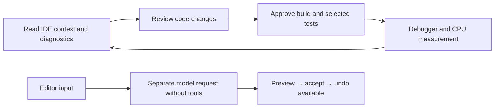

# Visual Studio IDE tools and editor suggestions

[한국어](VS-INTELLIGENCE.md) · **English** · [Documentation](README.md)

PiAgent 0.10.0 adds the five development stages below to Visual Studio 2022 **17.14 or later** and Visual Studio 2026. Install the workloads required by your project and configure a working OMP model connection.

| Stage | Available features | Scope |
|---|---|---|
| 1. IDE information | Solution, projects, configuration, active unsaved editor text, Error List and compiler diagnostics | Semantic definitions, references and callers use Roslyn C#/VB |
| 2. Validation | VS solution build/rebuild, discovery and filtered execution in a selected test project, TRX failures | Requires .NET SDK, restored dependencies and VSTest test adapters |
| 3. Debugger | Breakpoints, start/continue/step/stop, paused call stack and locals, expression evaluation | Current VS debugger; evaluation requires approval because getters/functions can execute |
| 4. Inline completion | Gray text at the caret, Tab acceptance, Esc dismissal and undo | Supported code editors, up to 64 KiB of current-document context |
| 5. Next edit and measurement | Related edit preview in the current document, acceptance/undo, top .NET CPU methods | One edit in the current document; CPU sampling of modern .NET processes attached to VS |



Ask chat to “Check my unsaved code and compiler errors and find references to Add” or “Build the solution after this change and run only AddsNumbers in Fixture.Tests.csproj.” The agent selects IDE tools and receives their actual results. Build, tests, debugger control and profiling use a separate approval card for each action. Plan/read-only mode cannot execute them. Save unsaved documents before build, tests or debugger start. Zero executed tests or a missing TRX report cannot be reported as success.

In the editor, use **Tools → PiAgent: Suggest Code** or **Suggest Next Edit**. Accept inline completion with Tab. For a next edit, use Tab to move to its location, press Tab again to accept, and undo with Ctrl+Z. Automatic requests default to off. **Tools → Options → PiAgent → Editor Suggestions** controls automatic completion, next edit after acceptance, delay and a separate provider/model. Leave both provider and model empty to use the OMP default. Enabling automatic requests can consume usage with the selected model provider.

Chat and editor inference use separate OMP processes. Editor inference disables tools, extensions and session storage and returns proposals only. New input or a moved caret cancels previous proposals; only matching document revisions are displayed. No document or disk changes occur before acceptance. Requests and acceptance are avoided during Korean IME composition; the native VS suggestion service coordinates with other providers.

Install the official tool separately for CPU capture.

```powershell
dotnet tool install --global dotnet-trace
```

Start debugging the target .NET app in VS first. The agent reads its process ID through `ide_debug` and proposes 1–30 seconds of CPU sampling. Result files remain in `%LOCALAPPDATA%\PiAgent\diagnostics`; clean them up as needed. Native C++/.NET Framework profiling, memory analysis, Test Explorer state control and next edits across multiple documents are outside this implementation. Existing RAD Studio VCL/FMX designer support is separate from these VS tools.
