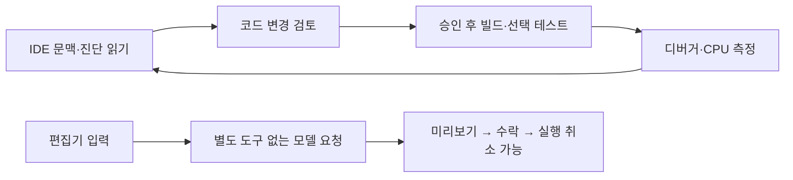

# Visual Studio IDE 도구와 편집기 제안

**한국어** · [English](VS-INTELLIGENCE.en.md) · [문서](README.md)

PiAgent 0.10.0은 다음 다섯 개발 단계를 Visual Studio 2022 **17.14 이상**과 Visual Studio 2026에 추가합니다. 프로젝트에 맞는 VS 워크로드와 정상 동작하는 OMP 모델 연결이 필요합니다.

| 단계 | 사용할 수 있는 기능 | 범위 |
|---|---|---|
| 1. IDE 정보 | 솔루션·프로젝트·구성, 활성 편집기의 미저장 코드, 오류 목록과 컴파일 진단 | 의미 기반 정의·참조·호출자 탐색은 Roslyn C#/VB |
| 2. 검증 | VS 솔루션 빌드·재빌드, 선택한 테스트 프로젝트의 발견·필터 실행, TRX 실패 원인 | .NET SDK, 복원된 의존성과 VSTest 테스트 adapter 필요 |
| 3. 디버거 | 중단점, 시작·계속·단계 실행·중지, 멈춘 위치의 호출 스택·지역 변수, 식 평가 | 현재 VS 디버거; 식 평가에는 getter/함수 실행 가능성이 있어 승인 필요 |
| 4. 인라인 완성 | 커서 위치에 회색 코드 제안, Tab 수락, Esc 닫기, 실행 취소 | 지원하는 코드 편집기, 한 문서당 64 KiB 문맥 |
| 5. 다음 수정·측정 | 현재 문서의 관련 수정 미리보기, 수락·실행 취소, .NET CPU 상위 메서드 | 현재 문서 한 곳의 수정, VS에 연결된 modern .NET 프로세스의 CPU 샘플링 |



채팅에 “저장하지 않은 코드와 컴파일 오류를 확인하고 Add의 참조를 찾아주세요”, “수정 후 솔루션을 빌드하고 Fixture.Tests.csproj의 AddsNumbers 테스트만 실행해주세요”처럼 요청합니다. 에이전트가 IDE 도구를 선택하며 실행 결과가 대화로 돌아옵니다. 빌드·테스트·디버거 제어·프로파일링은 작업별 승인 카드에서 실행합니다. 계획/읽기 모드에서는 실행하지 않습니다. 빌드·테스트·디버거 시작 전 미저장 문서를 저장해야 합니다. 테스트 0개 실행이나 TRX 부재는 성공으로 표시하지 않습니다.

편집기에서 **Tools → PiAgent: Suggest Code** 또는 **Suggest Next Edit**를 사용합니다. 인라인 완성은 Tab으로 수락합니다. 다음 수정은 첫 Tab으로 위치를 이동하고 두 번째 Tab으로 수락하며, Ctrl+Z로 되돌립니다. 자동 요청은 기본적으로 꺼져 있습니다. **Tools → Options → PiAgent → Editor Suggestions**에서 자동 완성, 수락 후 다음 수정, 지연 시간과 별도 provider/model을 설정합니다. provider와 model을 함께 비우면 OMP 기본 모델을 사용합니다. 자동 요청을 켜면 선택한 제공자의 모델 사용량이 발생할 수 있습니다.

채팅과 편집기 추론은 서로 다른 OMP 프로세스를 사용합니다. 편집기 추론은 도구·확장·세션 저장을 끄고 제안만 반환합니다. 입력이 바뀌거나 커서가 이동하면 이전 제안을 취소하고 버전이 맞는 응답만 표시합니다. 수락 전에는 문서나 디스크를 바꾸지 않습니다. 한글 조합 중 요청·수락을 피하고 기존 VS 제안 서비스로 다른 공급자와 조정합니다.

CPU 측정에는 공식 도구를 별도로 설치합니다.

```powershell
dotnet tool install --global dotnet-trace
```

먼저 VS에서 대상 .NET 앱을 디버깅으로 실행합니다. 에이전트가 `ide_debug`로 프로세스 ID를 읽고 1–30초 CPU 측정을 제안합니다. 결과 파일은 `%LOCALAPPDATA%\PiAgent\diagnostics`에 남습니다. 사용자가 필요에 따라 정리합니다. native C++/.NET Framework 프로파일링, 메모리 분석, Test Explorer 상태 제어, 여러 문서에 걸친 다음 수정은 이번 구현 범위에 포함되지 않습니다. RAD Studio의 기존 VCL/FMX 디자이너 기능은 별도 지원이며 이 VS 전용 도구와 혼동하지 않습니다.
